# STL各组件应用示例

## STL六大组件

STL六大组件包括**容器**(container)、**分配器**(allocator)、**算法**(algorithm)、**迭代器**(iterator)、**适配器**(adapter)和**仿函数**(functor).


<!-- more -->

STL中的区间遵循前闭后开的表示方式,迭代器`begin`指向的是第一个元素的起点,`end`指向的是最后一个元素的下一个元素.


## 容器

STL中的容器大体分为**序列容器**、**关联容器**和**无序容器**.


下面测试程序演示STL中各容器的使用,创建辅助函数如下:

```C++
const long ASIZE = 500000L;		// 数组大小

// 从console中读入一个 long
long get_a_target_long() {
    long target = 0;
   
    cout << "target (0~" << RAND_MAX << "): ";
    cin >> target;
    return target;
}

// 从console中读入一个 string 
string get_a_target_string() {
    long target = 0;
    char buf[10];

    cout << "target (0~" << RAND_MAX << "): ";
    cin >> target;
    snprintf(buf, 10, "%d", target);
    return string(buf);
}

// 比较 long
int compareLongs(const void *a, const void *b) {
    return (*(long *) a - *(long *) b);
}

// 比较 string
int compareStrings(const void *a, const void *b) {
    if (*(string *) a > *(string *) b)
        return 1;
    else if (*(string *) a < *(string *) b)
        return -1;
    else
        return 0;
}
```

### 使用`array`


C++11中将数组抽象成了一个模板类`array`.

```C++
#include <array>
#include <iostream>
#include <ctime>
#include <cstdlib> // qsort, bsearch, NULL

void test_array() {
    cout << "\ntest_array().......... \n";

array<long, ASIZE> c;

clock_t timeStart = clock();
    for (long i = 0; i < ASIZE; ++i) {
        c[i] = rand();
    }
    cout << "milli-seconds : " << (clock() - timeStart) << endl;    
    cout << "array.size()= " << c.size() << endl;
    cout << "array.front()= " << c.front() << endl;
    cout << "array.back()= " << c.back() << endl;
    cout << "array.data()= " << c.data() << endl;

long target = get_a_target_long();

    timeStart = clock();
    ::qsort(c.data(), ASIZE, sizeof(long), compareLongs);
long *pItem = (long *) ::bsearch(&target, (c.data()), ASIZE, sizeof(long), compareLongs);
    cout << "qsort()+bsearch(), milli-seconds : " << (clock() - timeStart) << endl;    //
    if (pItem != NULL)
        cout << "found, " << *pItem << endl;
    else
        cout << "not found! " << endl;
}
```

输出如下:
```C++
test_array()..........
milli-seconds : 13
array.size()= 500000
array.front()= 28060
array.back()= 25634
array.data()= 0x6a7910
target (0~32767):20000
qsort()+bsearch(), milli-seconds : 88
found, 20000
```

### 使用`vector`

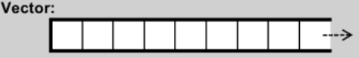

```C++
#include <vector>
#include <stdexcept>
#include <string>
#include <cstdlib> 		// abort()
#include <cstdio>  		// snprintf()
#include <iostream>
#include <ctime>
#include <algorithm>	// sort()

void test_vector(long &value) {
    cout << "\ntest_vector().......... \n";

vector<string> c;
char buf[10];

clock_t timeStart = clock();
    for (long i = 0; i < value; ++i) {
        try {
            snprintf(buf, 10, "%d", rand());
            c.push_back(string(buf));
        }
        catch (exception &p) {
            cout << "i=" << i << " " << p.what() << endl;
            // 曾經最高 i=58389486 then std::bad_alloc
            abort();
        }
    }
    cout << "milli-seconds : " << (clock() - timeStart) << endl;
    cout << "vector.max_size()= " << c.max_size() << endl;  
    cout << "vector.size()= " << c.size() << endl;
    cout << "vector.front()= " << c.front() << endl;
    cout << "vector.back()= " << c.back() << endl;
    cout << "vector.data()= " << c.data() << endl;
    cout << "vector.capacity()= " << c.capacity() << endl << endl;


string target = get_a_target_string();
    {
        timeStart = clock();
auto pItem = find(c.begin(), c.end(), target);
        cout << "std::find(), milli-seconds : " << (clock() - timeStart) << endl;

        if (pItem != c.end())
            cout << "found, " << *pItem << endl << endl;
        else
            cout << "not found! " << endl << endl;
    }

    {
        timeStart = clock();
        sort(c.begin(), c.end());
        cout << "sort(), milli-seconds : " << (clock() - timeStart) << endl;

        timeStart = clock();
string *pItem = (string *) ::bsearch(&target, (c.data()), c.size(), sizeof(string), compareStrings);
        cout << "bsearch(), milli-seconds : " << (clock() - timeStart) << endl;

        if (pItem != NULL)
            cout << "found, " << *pItem << endl << endl;
        else
            cout << "not found! " << endl << endl;
    }
}
```

输出如下:
```C++
how many elements:1000000

test_vector()..........
milli-seconds : 211
vector.max_size()= 576460752303423487
vector.size()= 1000000
vector.front()= 30271
vector.back()= 7756
vector.data()= 0x4830040
vector.capacity()= 1048576

target (0~32767):23456
std::find(), milli-seconds : 1
found, 23456

sort(), milli-seconds : 2695
bsearch(), milli-seconds : 1
found, 23456
```

`vector`底层是一段连续的内存空间,当容器满时进行扩容,将容器大小扩容为原来的两倍.

### 使用`list`

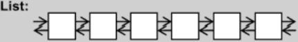

```C++
#include <list>
#include <stdexcept>
#include <string>
#include <cstdlib> 		// abort()
#include <cstdio>  		// snprintf()
#include <algorithm> 	// find()
#include <iostream>
#include <ctime>

void test_list(long &value) {
    cout << "\ntest_list().......... \n";

list <string> c;
char buf[10];

clock_t timeStart = clock();
    for (long i = 0; i < value; ++i) {
        try {
            snprintf(buf, 10, "%d", rand());
            c.push_back(string(buf));
        }
        catch (exception &p) {
            cout << "i=" << i << " " << p.what() << endl;
            abort();
        }
    }
    cout << "milli-seconds : " << (clock() - timeStart) << endl;
    cout << "list.size()= " << c.size() << endl;
    cout << "list.max_size()= " << c.max_size() << endl;    //357913941
    cout << "list.front()= " << c.front() << endl;
    cout << "list.back()= " << c.back() << endl;

string target = get_a_target_string();
	timeStart = clock();
auto pItem = find(c.begin(), c.end(), target);
    cout << "std::find(), milli-seconds : " << (clock() - timeStart) << endl;

    if (pItem != c.end())
        cout << "found, " << *pItem << endl;
    else
        cout << "not found! " << endl;

	timeStart = clock();
    c.sort();
    cout << "c.sort(), milli-seconds : " << (clock() - timeStart) << endl;
}
```

输出如下:
```C++
how many elements:1000000

test_list()..........
milli-seconds : 406
list.size()= 1000000
list.max_size()= 384307168202282325
list.front()= 31411
list.back()= 7939
target (0~32767):23456
std::find(), milli-seconds : 4
found, 23456
c.sort(), milli-seconds : 3610
```

程序第44行调用的是`list`类的成员函数`sort`,而非标准库中的算法`sort`.这是因为`list`类本身具有`sort`方法,容器本身实现的`sort`的性能一般比标准库中的算法`sort`更好.

### 使用`forward_list`

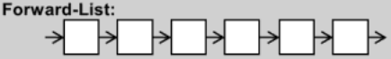

`forward_list`是C++11标准引入的,其前身是gcc中的`slist`.

```C++
#include <forward_list>
#include <stdexcept>
#include <string>
#include <cstdlib> 	// abort()
#include <cstdio>  	// snprintf()
#include <iostream>
#include <ctime>

void test_forward_list(long &value) {
    cout << "\ntest_forward_list().......... \n";

forward_list <string> c;
char buf[10];

clock_t timeStart = clock();
    for (long i = 0; i < value; ++i) {
        try {
            snprintf(buf, 10, "%d", rand());
            c.push_front(string(buf));
        }
        catch (exception &p) {
            cout << "i=" << i << " " << p.what() << endl;
            abort();
        }
    }
    cout << "milli-seconds : " << (clock() - timeStart) << endl;
    cout << "forward_list.max_size()= " << c.max_size() << endl;  //536870911
    cout << "forward_list.front()= " << c.front() << endl;

string target = get_a_target_string();
    timeStart = clock();
auto pItem = find(c.begin(), c.end(), target);
    cout << "std::find(), milli-seconds : " << (clock() - timeStart) << endl;

    if (pItem != c.end())
        cout << "found, " << *pItem << endl;
    else
        cout << "not found! " << endl;

    timeStart = clock();
    c.sort();
    cout << "c.sort(), milli-seconds : " << (clock() - timeStart) << endl;
}
```

输出如下:
```C++
how many elements:1000000

test_forward_list()..........
milli-seconds : 296
forward_list.max_size()= 461168601842738790
forward_list.front()= 11513
target (0~32767):23456
std::find(), milli-seconds : 9
found, 23456
c.sort(), milli-seconds : 3706
```


### 使用`deque`

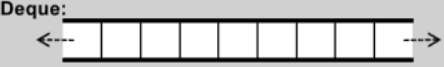

`deque`容器可以再双端插入和删除,其底层是分段连续的,对于使用者来说造成了一种连续的假象.

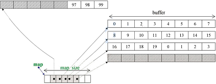

```C++
#include <deque>
#include <stdexcept>
#include <string>
#include <cstdlib> 	// abort()
#include <cstdio>  	// snprintf()
#include <iostream>
#include <ctime>

void test_deque(long &value) {
    cout << "\ntest_deque().......... \n";

deque <string> c;
char buf[10];

clock_t timeStart = clock();
    for (long i = 0; i < value; ++i) {
        try {
            snprintf(buf, 10, "%d", rand());
            c.push_back(string(buf));
        }
        catch (exception &p) {
            cout << "i=" << i << " " << p.what() << endl;
            abort();
        }
    }
    cout << "milli-seconds : " << (clock() - timeStart) << endl;
    cout << "deque.size()= " << c.size() << endl;
    cout << "deque.front()= " << c.front() << endl;
    cout << "deque.back()= " << c.back() << endl;
    cout << "deque.max_size()= " << c.max_size() << endl;    

string target = get_a_target_string();
    timeStart = clock();
auto pItem = find(c.begin(), c.end(), target);
    cout << "std::find(), milli-seconds : " << (clock() - timeStart) << endl;

    if (pItem != c.end())
        cout << "found, " << *pItem << endl;
    else
        cout << "not found! " << endl;

    timeStart = clock();
    sort(c.begin(), c.end());
    cout << "sort(), milli-seconds : " << (clock() - timeStart) << endl;
}
```

输出如下:

```C++
how many elements:1000000

test_deque()..........
milli-seconds : 170
deque.size()= 1000000
deque.front()= 4080
deque.back()= 29186
deque.max_size()= 576460752303423487
target (0~32767):23456
std::find(), milli-seconds : 5
found, 23456
sort(), milli-seconds : 2924
```

`vector`容器满时就扩充一个buffer.

### 使用`stack`和`queue`

`stack`和`queue`底层是通过`deque`实现的,从设计模式上来说,这两种容器本质上是`deque`的适配器.

| stack | queue |
| :----: | :----: |
|  |  |

这两个容器的元素进出是有严格顺序的,因此`stack`和`queue`不支持有关迭代器的操作.

```C++
#include <stack>
#include <queue>
#include <stdexcept>
#include <string>
#include <cstdlib> 	// abort()
#include <cstdio>  	// snprintf()
#include <iostream>
#include <ctime>

void test_stack(long &value) {
    cout << "\ntest_stack().......... \n";

stack <string> c;
char buf[10];

clock_t timeStart = clock();
    for (long i = 0; i < value; ++i) {
        try {
            snprintf(buf, 10, "%d", rand());
            c.push(string(buf));
        }
        catch (exception &p) {
            cout << "i=" << i << " " << p.what() << endl;
            abort();
        }
    }
    cout << "milli-seconds : " << (clock() - timeStart) << endl;
    cout << "stack.size()= " << c.size() << endl;
    cout << "stack.top()= " << c.top() << endl;
    c.pop();
    cout << "stack.size()= " << c.size() << endl;
    cout << "stack.top()= " << c.top() << endl;
}

void test_queue(long &value) {
    cout << "\ntest_queue().......... \n";

queue <string> c;
char buf[10];

clock_t timeStart = clock();
    for (long i = 0; i < value; ++i) {
        try {
            snprintf(buf, 10, "%d", rand());
            c.push(string(buf));
        }
        catch (exception &p) {
            cout << "i=" << i << " " << p.what() << endl;
            abort();
        }
    }
    cout << "milli-seconds : " << (clock() - timeStart) << endl;
    cout << "queue.size()= " << c.size() << endl;
    cout << "queue.front()= " << c.front() << endl;
    cout << "queue.back()= " << c.back() << endl;
    c.pop();
    cout << "queue.size()= " << c.size() << endl;
    cout << "queue.front()= " << c.front() << endl;
    cout << "queue.back()= " << c.back() << endl;
}
```

输出如下:
```C++
how many elements:300000

test_stack()..........
milli-seconds : 57
stack.size()= 300000
stack.top()= 17153
stack.size()= 299999
stack.top()= 31703


how many elements:300000

test_queue()..........
milli-seconds : 54
queue.size()= 300000
queue.front()= 6608
queue.back()= 29870
queue.size()= 299999
queue.front()= 7837
queue.back()= 29870
```

### 使用`multiset`和`multimap`

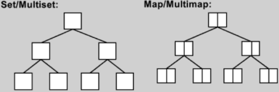

`multiset`和`multimap`底层是使用红黑树实现的.

```C++
#include <set>
#include <map>
#include <stdexcept>
#include <string>
#include <cstdlib> 	// abort()
#include <cstdio>  	// snprintf()
#include <iostream>
#include <ctime>

void test_multiset(long &value) {
    cout << "\ntest_multiset().......... \n";

multiset <string> c;
char buf[10];
clock_t timeStart = clock();
    for (long i = 0; i < value; ++i) {
        try {
            snprintf(buf, 10, "%d", rand());
            c.insert(string(buf));
        }
        catch (exception &p) {
            cout << "i=" << i << " " << p.what() << endl;
            abort();
        }
    }
    cout << "milli-seconds : " << (clock() - timeStart) << endl;
    cout << "multiset.size()= " << c.size() << endl;
    cout << "multiset.max_size()= " << c.max_size() << endl;   

string target = get_a_target_string();
    {
        timeStart = clock();
        auto pItem = find(c.begin(), c.end(), target);    	//比 multiset::find(...) 慢很多
        cout << "std::find(), milli-seconds : " << (clock() - timeStart) << endl;
        if (pItem != c.end())
            cout << "found, " << *pItem << endl;
        else
            cout << "not found! " << endl;
    }

    {
        timeStart = clock();
        auto pItem = c.find(target);        				//比 std::find(...) 快很多
        cout << "c.find(), milli-seconds : " << (clock() - timeStart) << endl;
        if (pItem != c.end())
            cout << "found, " << *pItem << endl;
        else
            cout << "not found! " << endl;
    }
}

void test_multimap(long &value) {
    cout << "\ntest_multimap().......... \n";

multimap<long, string> c;
char buf[10];

clock_t timeStart = clock();
    for (long i = 0; i < value; ++i) {
        try {
            snprintf(buf, 10, "%d", rand());
            //multimap 不可使用 [] 做 insertion
            c.insert(pair<long, string>(i, buf));
        }
        catch (exception &p) {
            cout << "i=" << i << " " << p.what() << endl;
            abort();
        }
    }
    cout << "milli-seconds : " << (clock() - timeStart) << endl;
    cout << "multimap.size()= " << c.size() << endl;
    cout << "multimap.max_size()= " << c.max_size() << endl;    //178956970

long target = get_a_target_long();
    timeStart = clock();
    auto pItem = c.find(target);
    cout << "c.find(), milli-seconds : " << (clock() - timeStart) << endl;
    if (pItem != c.end())
        cout << "found, value=" << (*pItem).second << endl;
    else
        cout << "not found! " << endl;

    c.clear();
}
```


因为`multimap`支持重复的key,因此不能使用重载的`[]`运算符进行插入.输出如下:

```C++
how many elements:1000000

test_multiset()..........
milli-seconds : 5202
multiset.size()= 1000000
multiset.max_size()= 288230376151711743
target (0~32767):23456
std::find(), milli-seconds : 75
found, 23456
c.find(), milli-seconds : 0
found, 23456


how many elements:1000000

test_multimap()..........
milli-seconds : 1423
multimap.size()= 1000000
multimap.max_size()= 256204778801521550
target (0~32767):23456
c.find(), milli-seconds : 0
found, value=13328
```

### 使用`unordered_multiset`和`unordered_multimap`

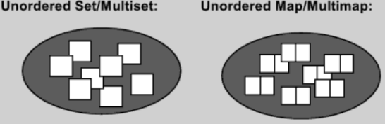

`unordered_multiset`和`unordered_multimap`底层是使用hash+链表实现的.

`unordered_multiset`和`unordered_multimap`的元素个数小于篮子数目,若元素数目达到篮子个数,则容器扩容,将篮子数组扩充约一倍.

```C++
#include <unordered_set>
#include <unordered_map>
#include <stdexcept>
#include <string>
#include <cstdlib> 	// abort()
#include <cstdio>  	// snprintf()
#include <iostream>
#include <ctime>

void test_unordered_multiset(long &value) {
    cout << "\ntest_unordered_multiset().......... \n";

unordered_multiset <string> c;
char buf[10];

clock_t timeStart = clock();
    for (long i = 0; i < value; ++i) {
        try {
            snprintf(buf, 10, "%d", rand());
            c.insert(string(buf));
        }
        catch (exception &p) {
            cout << "i=" << i << " " << p.what() << endl;
            abort();
        }
    }
    cout << "milli-seconds : " << (clock() - timeStart) << endl;
    cout << "unordered_multiset.size()= " << c.size() << endl;
    cout << "unordered_multiset.max_size()= " << c.max_size() << endl;    //357913941
    cout << "unordered_multiset.bucket_count()= " << c.bucket_count() << endl;
    cout << "unordered_multiset.load_factor()= " << c.load_factor() << endl;
    cout << "unordered_multiset.max_load_factor()= " << c.max_load_factor() << endl;
    cout << "unordered_multiset.max_bucket_count()= " << c.max_bucket_count() << endl;
    for (unsigned i = 0; i < 10; ++i) {
        cout << "bucket #" << i << " has " << c.bucket_size(i) << " elements.\n";
    }

string target = get_a_target_string();
    {
        timeStart = clock();
        auto pItem = find(c.begin(), c.end(), target);    //比 unordered_multiset::find() 慢很多
        cout << "std::find(), milli-seconds : " << (clock() - timeStart) << endl;
        if (pItem != c.end())
            cout << "found, " << *pItem << endl;
        else
            cout << "not found! " << endl;
    }

    {
        timeStart = clock();
        auto pItem = c.find(target);        //比 std::find() 快很多
        cout << "c.find(), milli-seconds : " << (clock() - timeStart) << endl;
        if (pItem != c.end())
            cout << "found, " << *pItem << endl;
        else
            cout << "not found! " << endl;
    }
}

void test_unordered_multimap(long &value) {
    cout << "\ntest_unordered_multimap().......... \n";

unordered_multimap<long, string> c;
char buf[10];

clock_t timeStart = clock();
    for (long i = 0; i < value; ++i) {
        try {
            snprintf(buf, 10, "%d", rand());
            //multimap 不可使用 [] 進行 insertion
            c.insert(pair<long, string>(i, buf));
        }
        catch (exception &p) {
            cout << "i=" << i << " " << p.what() << endl;
            abort();
        }
    }
    cout << "milli-seconds : " << (clock() - timeStart) << endl;
    cout << "unordered_multimap.size()= " << c.size() << endl;
    cout << "unordered_multimap.max_size()= " << c.max_size() << endl;   

long target = get_a_target_long();
    timeStart = clock();
    auto pItem = c.find(target);
    cout << "c.find(), milli-seconds : " << (clock() - timeStart) << endl;
    if (pItem != c.end())
        cout << "found, value=" << (*pItem).second << endl;
    else
        cout << "not found! " << endl;
}
```

输出如下:
```C++
how many elements:1000000

test_unordered_multiset()..........
milli-seconds : 1476
unordered_multiset.size()= 1000000
unordered_multiset.max_size()= 384307168202282325
unordered_multiset.bucket_count()= 1832561
unordered_multiset.load_factor()= 0.545684
unordered_multiset.max_load_factor()= 1
unordered_multiset.max_bucket_count()= 384307168202282325
bucket #0 has 0 elements.
bucket #1 has 0 elements.
bucket #2 has 0 elements.
bucket #3 has 0 elements.
bucket #4 has 0 elements.
bucket #5 has 0 elements.
bucket #6 has 0 elements.
bucket #7 has 34 elements.
bucket #8 has 0 elements.
bucket #9 has 0 elements.
target (0~32767):23456
std::find(), milli-seconds : 104
found, 23456
c.find(), milli-seconds : 1
found, 23456


how many elements:1000000

test_unordered_multimap()..........
milli-seconds : 1051
unordered_multimap.size()= 1000000
unordered_multimap.max_size()= 384307168202282325
target (0~32767):23456
 c.find(), milli-seconds : 0
found, value=20464
```

## 分配器

STL容器默认的分配器是`std::allocator`,除此之外gcc额外定义了几个分配器,其头文件均在目录`ext`下.


gcc额外定义的分配器均位于`__gnu_cxx`命名空间下.分配器一般用于构建容器,不会直接使用.因为分配器想要直接使用也不好用(使用`free`关键字时不需要指定回收内存的大小,而分配器的`deallocate`函数需要指定回收内存大小).

```C++
#include <list>
#include <stdexcept>
#include <string>
#include <cstdlib>		// abort()
#include <cstdio>		// snprintf()
#include <algorithm>	// find()
#include <iostream>
#include <ctime>
#include <cstddef>
#include <memory>    //內含 std::allocator
//欲使用 std::allocator 以外的 allocator,得自行 #include <ext\...>
#ifdef __GNUC__

#include <ext\array_allocator.h>
#include <ext\mt_allocator.h>
#include <ext\debug_allocator.h>
#include <ext\pool_allocator.h>
#include <ext\bitmap_allocator.h>
#include <ext\malloc_allocator.h>
#include <ext\new_allocator.h>

#endif


//pass A object to function template impl()，
//而 A 本身是個 class template, 帶有 type parameter T,
//那麼有無可能在 impl() 中抓出 T, 創建一個 list<T, A<T>> object?
//以下先暫時迴避上述疑問.

void test_list_with_special_allocator() {
#ifdef __GNUC__
    cout << "\ntest_list_with_special_allocator().......... \n";

    //不能在 switch case 中宣告，只好下面這樣. 				  	// 1000000次
    list <string, allocator<string>> c1;                   	// 3140
    list <string, __gnu_cxx::malloc_allocator<string>> c2; 	// 3110
    list <string, __gnu_cxx::new_allocator<string>> c3;		// 3156
    list <string, __gnu_cxx::__pool_alloc<string>> c4;     	// 4922
    list <string, __gnu_cxx::__mt_alloc<string>> c5;        // 3297
    list <string, __gnu_cxx::bitmap_allocator<string>> c6; 	// 4781

    int choice;
    long value;

    cout << "select: "
        << " (1) std::allocator "
        << " (2) malloc_allocator "
        << " (3) new_allocator "
        << " (4) __pool_alloc "
        << " (5) __mt_alloc "
        << " (6) bitmap_allocator ";

    cin >> choice;
    if (choice != 0) {
        cout << "how many elements: ";
        cin >> value;
    }

    char buf[10];
    clock_t timeStart = clock();
    for (long i = 0; i < value; ++i) {
        try {
            snprintf(buf, 10, "%d", i);
            switch (choice) {
                case 1 :
                    c1.push_back(string(buf));
                    break;
                case 2 :
                    c2.push_back(string(buf));
                    break;
                case 3 :
                    c3.push_back(string(buf));
                    break;
                case 4 :
                    c4.push_back(string(buf));
                    break;
                case 5 :
                    c5.push_back(string(buf));
                    break;
                case 6 :
                    c6.push_back(string(buf));
                    break;
                default:
                    break;
            }
        }
        catch (exception &p) {
            cout << "i=" << i << " " << p.what() << endl;
            abort();
        }
    }
    cout << "a lot of push_back(), milli-seconds : " << (clock() - timeStart) << endl;

    //test all allocators' allocate() & deallocate();
    int *p;
    allocator<int> alloc1;
    p = alloc1.allocate(1);
    alloc1.deallocate(p, 1);

    __gnu_cxx::malloc_allocator<int> alloc2;
    p = alloc2.allocate(1);
    alloc2.deallocate(p, 1);

    __gnu_cxx::new_allocator<int> alloc3;
    p = alloc3.allocate(1);
    alloc3.deallocate(p, 1);

    __gnu_cxx::__pool_alloc<int> alloc4;
    p = alloc4.allocate(2);
    alloc4.deallocate(p, 2);    //我刻意令參數為 2, 但這有何意義!! 一次要 2 個 ints?

    __gnu_cxx::__mt_alloc<int> alloc5;
    p = alloc5.allocate(1);
    alloc5.deallocate(p, 1);

    __gnu_cxx::bitmap_allocator<int> alloc6;
    p = alloc6.allocate(3);
    alloc6.deallocate(p, 3);    //我刻意令參數為 3, 但這有何意義!! 一次要 3 個 ints?
#endif
}
```

# STL容器源码分析

## STL设计模式:OOP和GP

OOP(Object-Oriented Programming)和GP(Generic Programming)是STL容器设计中使用的两种设计模式.

- OOP的目的是将**数据**和**方法**绑定在一起,例如对`std::list`容器进行排序要调用`std::list::sort`方法.
- GP的目的是将**数据**和**方法**分离开来,例如对`std::vector`容器进行排序要调用`std::sort`方法.

这种不同是因为`std::sort`方法内部调用了`iterator`的`-`运算,`std::list`的`iterator`没有实现`-`运算符,而`std::vector`的`iterator`实现了`-`运算符.

```C++
template<typename _RandomAccessIterator>
inline void sort(_RandomAccessIterator __first, _RandomAccessIterator __last) {
    std::__sort(__first, __last, __gnu_cxx::__ops::__iter_less_iter());
}

inline void __sort(_RandomAccessIterator __first, _RandomAccessIterator __last, _Compare __comp) {
    if (__first != __last) {
        std::__introsort_loop(__first, __last,
                              std::__lg(__last - __first) * 2,		// 对iterator进行减运算,std::list的iterator没有实现该运算
                              __comp);
        std::__final_insertion_sort(__first, __last, __comp);
    }
}
```

## 运算符重载与模板特化

实现STL的两大基础就是**运算符重载**和**模板特化**.


## 分配器

VC6.0的默认分配器`std::allocator`定义如下,可以看到VC6.0的分配器只是对`::operator new`和`::operator delete`的简单封装.

```C++
template<class _Ty>
class allocator {
public:
    typedef _SIZT size_type;
    typedef _PDFT difference_type;
    typedef _Ty _FARQ *pointer;
    typedef _Ty value_type;

    pointer allocate(size_type _N, const void *) {
        return (_Allocate((difference_type) _N，(pointer) 0));
    }

    void deallocate(void _FARQ *_P, size_type) {
        operator delete(_P);
    };
    
private:
    inline _Ty _FARQ *_Allocate(_PDFT _N, _Ty _FARQ *) {
        if (_N < 0) _N = 0;
        return ((_Ty _FARQ *) operator new((_SIZT) _N * sizeof(_Ty)));
    }

//...
};
```

gcc2.9中的分配器`std::allocator`与VC6.0的实现类似,但`std::allocator`并非gcc2.9的默认分配器,观察容器源码,可以看到,gcc2.9的默认分配器为`std::alloc`.

```C++
template<class T, class Alloc = alloc>
class vector {
    // ...
};

template<class T, class Alloc = alloc>
class list {
    // ...
};

template<class T, class Alloc = alloc, size_t BufSiz = 0>
class deque {
    // ...
};
```

`std::alloc`的代码结构如下:

```C++
class alloc {
protected:

    enum { _S_align = 8 };
    enum { _S_max_bytes = 128 };
    enum { _S_free_list_size = (size_t) _S_max_bytes / (size_t) _S_align };

    union _Obj {
        union _Obj *_M_free_list_link;
        char _M_client_data[1];    // The client sees this.
    };
    
    // ...
}
```


`std::alloc`内部维护一个链表数组,数组中的每个链表保存某个尺寸的对象,减少了调用`malloc`的次数,从而减小了`malloc`带来的额外开销.

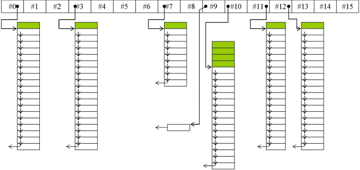

在gcc4.9以后,默认分配器变为`std::allocator`,变回了对`::operator new`和`::operator delete`的简单封装.gcc2.9中的`std::alloc`更名为`__gnu_cxx::__pool_alloc`.

## 容器

STL容器的各实现类关系如下图所示,以缩排形式表示衍生关系(主要是**复合关系**).

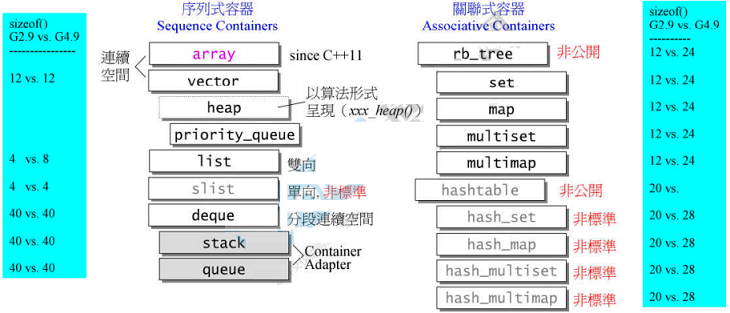

### 容器`list`

gcc2.9中`list`及相关类的代码如下所示:

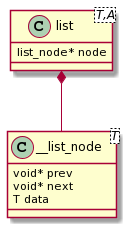

```C++
template<class T, class Alloc = alloc>
class list {
protected:
    typedef __list_node<T> list_node;
public:
    typedef list_node *link_type;
    typedef __list_iterator<T, T &, T *> iterator;
protected:
    link_type node;
};
```

```C++
template<class T>
struct __list_node {
    typedef void *void_pointer;
    void_pointer prev;
    void_pointer next;
    T data;
};
```

为实现前闭后开的特性,在环形链表末尾加入一个用以占位的空节点,并将迭代器`list::end()`指向该节点.

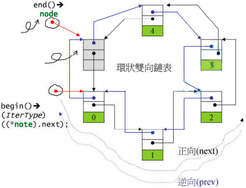

迭代器`__list_iterator`重载了指针的`*`,`->`,`++`,`--`等运算符,并定义了`iterator_category`、`value_type`、`difference_type`、`pointer`和`reference`5个**关联类型**(associated types),这些特征将被STL算法使用.

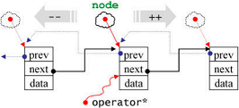

```C++
template<class T, class Ref, class Ptr>
struct __list_iterator {
    typedef __list_iterator<T, Ref, Ptr> self;
    typedef bidirectional_iterator_tag 	iterator_category; 	// 关联类型1
    typedef T 							value_type;			// 关联类型2
    typedef ptrdiff_t 					difference_type;	// 关联类型3
    typedef Ptr 						pointer;			// 关联类型4
    typedef Ref 						reference;			// 关联类型5

    typedef __list_node <T>*			link_type;
    link_type node;		// 指向的链表节点

    reference operator*() const { return (*node).data; }
    pointer operator->() const { return &(operator*()); }

    self& operator++() {
        node = (link_type) ((*node).next);
        return *this;
    }

    self operator++(int) {
        self tmp = *this;
        ++*this;
        return tmp;
    }
};
```

注意在这里前置`++`运算符返回左值,而后置`++`返回右值,这与基础类型的`++`和`--`运算一致.

```C++
int i(6);
i++++;		// 被解析为 ++(++i), 能通过编译
++++i;		// 被解析为 (i++)++, 不能通过编译

list<int> c;
auto ite = c.begin();
++++ite;	// 被解析为 ++(++ite), 能通过编译
ite++++;	// 被解析为 (ite++)++, 不能通过编译
```

在gcc4.9以后,`list`相关的类使用了继承,增加了不必要的复杂度.

STL的算法传入的参数的一般是迭代器或指针,在算法内部,需要根据传入的迭代器或指针推断出迭代器的**关联类型**(associated types).

```C++
template<typename _ForwardIterator>
inline _ForwardIterator rotate(_ForwardIterator __first, _ForwardIterator __middle, _ForwardIterator __last) {
    return std::__rotate(__first, __middle, __last, std::__iterator_category(__first));
}

template<typename _Iter>
inline typename iterator_traits<_Iter>::iterator_category 
__iterator_category(const _Iter &) { 
    return typename iterator_traits<_Iter>::iterator_category(); 	// 推断迭代器的关联类型 iterator_category
}
```

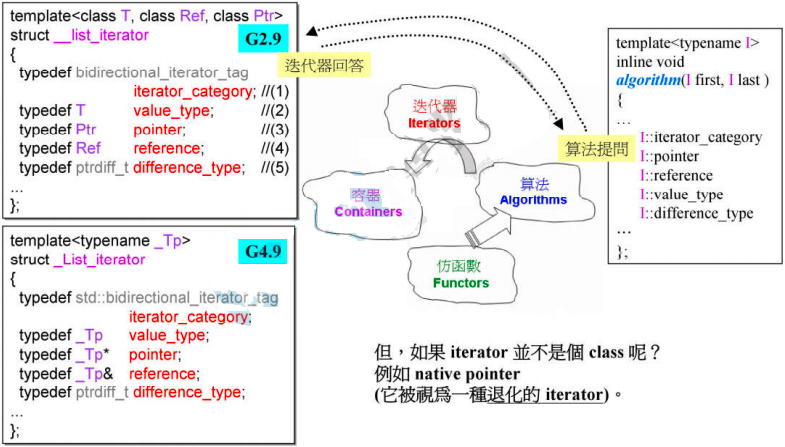

迭代器的5个关联类型在类中均有定义,但是指针类型的关联类型需要根据指针类别进行确定,为了使STL算法同时兼容迭代器和一般指针,就在迭代器(指针)和算法之间加一个中间层**萃取器**(traits).

迭代器萃取器`iterator_traits`能够兼容迭代器和一般指针,获取其5个关联类型:`iterator_category`、`value_type`、`difference_type`、`pointer`和`reference`.

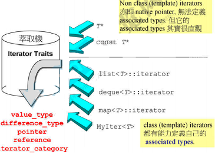

在实现上,`iterator_traits`类使用模板的偏特化,对于一般的迭代器类型,直接取迭代器内部定义的关联类型;对于指针和常量指针进行偏特化,指定关联类型的值.

```C++
// 针对一般的迭代器类型,直接取迭代器内定义的关联类型
template<class I>
struct iterator_traits {
    typedef typename I::iterator_category 	iterator_category;
    typedef typename I::value_type 			value_type;
    typedef typename I::difference_type 	difference_type;
    typedef typename I::pointer 			pointer;
    typedef typename I::reference 			reference;
};

// 针对指针类型进行特化,指定关联类型的值
template<class T>
struct iterator_traits<T *> {
    typedef random_access_iterator_tag 		iterator_category;
    typedef T 								value_type;
    typedef ptrdiff_t 						difference_type;
    typedef T*								pointer;
    typedef T&								reference;
};

// 针对指针常量类型进行特化,指定关联类型的值
template<class T>
struct iterator_traits<const T *> {
    typedef random_access_iterator_tag 		iterator_category;
    typedef T 								value_type;		// value_tye被用于创建变量,为灵活起见,取 T 而非 const T 作为 value_type
    typedef ptrdiff_t 						difference_type;
    typedef const T*						pointer;
    typedef const T&						reference;
};
```

想要在算法内获取关联类型的值,只需像下面这样写:

```C++
template<typename T>
void algorithm(...) {
    typename iterator_traits<I>::value_type v1;
}
```

### 容器`vector`

容器`vector`的代码如下:

```C++
template<class T, class Alloc= alloc>
class vector {
public:
    typedef T value_type;
    typedef value_type* iterator;
    typedef value_type& reference;
    typedef size_t size_type;
protected:
    iterator start;
    iterator finish;
    iterator end_of_storage;
public:
    iterator begin() { return start; }
    iterator end() { return finish; }
    size_type size() const { return size_type(end() - begin()); }
    size_type capacity() const { return size_type(end_of_storage - begin()); }
    bool empty() const { return begin() == end(); }
    reference operator[](size_type n) { return *(begin() + n); }
    reference front() { return *begin(); }
    reference back() { return *(end() - 1); }
};
```

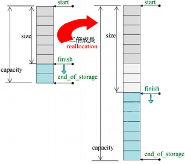

容器`vector`的迭代器`start`指向第一个元素,迭代器`finish`指向最后一个元素的下一个元素,这两个迭代器对应`begin()`和`end()`的返回值,维持了**前闭后开**的特性.

`vector`对使用者是连续的,因此重载了`[]`运算符.

`vector`的实现也是连续的,因此使用指针类型做迭代器(即迭代器`vector<T>::iterator`的实际类型是原生指针`T*`).

`vector::push_back`方法先判断内存空间是否满,若内存空间不满则直接插入;若内存空间满则调用`insert_aux`函数先扩容两倍再插入元素.

```C++
void push_back(const T &x) {
    if (finish != end_of_storage) { // 尚有备用空间,则直接插入,并调整finish迭代器
        construct(finish, x);		
        ++finish;					
    } else 							// 已无备用空间则调用 insert_aux 先扩容再插入元素
        insert_aux(end(), x);
}
```

`insert_aux`被设计用于在容器任意位置插入元素,在容器内存空间不足会现将原有容器扩容.

```C++
template<class T, class Alloc>
void vector<T, Alloc>::insert_ux(iterator position, const T &x) {
    if (finish != end_of_storage) {     // 尚有备用空间,则将插入点后元素后移一位并插入元素
        construct(finish, *(finish - 1));   // 以vector最后一个元素值为新节点的初值
        ++finish;
        T x_copy = x;
        copy_backward(position, finish - 2, finish - 1);
        *position = x_copy;
    } else {
        // 已无备用空间,则先扩容,再插入
        const size_type old_size = size();
        const size_type len = old_size != 0 ?: 2 * old_size:1;  // 扩容后长度为原长度的两倍

        iterator new_start = data_allocator::allocate(len);
        iterator new_finish = new_start;
        try {
            new_finish = uninitialized_copy(start, position, new_start);    // 拷贝插入点前的元素
            construct(new_finish, x);                                       // 插入新元素并调整水位
            ++new_finish;
            new_finish = uninitialized_copy(position, finish, new_finish);  // 拷贝插入点后的元素
        }
        catch (...) {
            // 插入失败则回滚,释放内存并抛出错误
            destroy(new_start, new_finish) :
            data_allocator::deallocate(new_start, len);
            throw;
        }
        // 释放原容器所占内存
        destroy(begin(), end());
        deallocate();
        // 调整迭代器
        start = new_start;
        finish = new_finish;
        end_of_storage = new_start + len;
    }
};
```

### 容器`array`

将数组封装成容器`array`是为了使之与STL算法兼容,其内部实现只是简单封装了一下数组,甚至没有构造函数和析构函数.与`vector`一样使用原生指针做迭代器.

```C++
template<typename _Tp, std::size_t _Nm>
struct array {
    typedef _Tp value_type;
    typedef _Tp *pointer;
    typedef value_type *iterator;

    value_type _M_instance[_Nm ? _Nm : 1];	// Support for zero-sized arrays mandatory

    iterator begin() {
        return iterator(&_M_instance[0]);
    }

    iterator end() {
        return iterator(&_M_instance[_Nm]);
    }
};
```

### 容器`deque`

容器`deque`内部是分段连续的,对使用者表现为连续的.

```C++
template<class T, class Alloc =alloc, size_t BufSiz = 0>
class deque {
public:
    typedef T value_type;
    typedef _deque_iterator<T, T &, T *, BufSiz> iterator;
protected:
    typedef pointer *map_pointer;   // T**
protected:
    iterator start;
    iterator finish;
    map_pointer map;		// 控制中心,数组中每个元素指向一个buffer
    size_type map_size;
public:
    iterator begin() { return start; }
    iterator end() { return finish; }
    size_type size() const { return finish - start; }
    // ...
};
```

`deque::map`的类型为二重指针`T**`,称为**控制中心**,其中每个元素指向一个buffer.

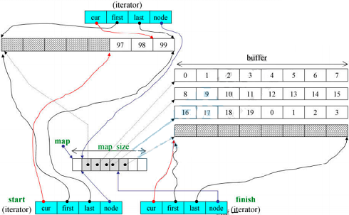

```C++
template<class T, class Ref, class Ptr, size_t BufSiz>
struct __deque_iterator {
    // 定义5个关联类型
    typedef random_access_iterator_tag	iterator_category; 	// 关联类型1
    typedef T 							value_type;       	// 关联类型2
    typedef ptrdiff_t 					difference_type;	// 关联类型3
    typedef Ptr 						pointer;			// 关联类型4
    typedef Ref 						reference;			// 关联类型5

    typedef size_t size_type;
    typedef T **map_pointer;
    typedef __deque_iterator self;

    // 迭代器核心字段:4个指针
    T *cur;     		// 指向当前元素
    T *first;   		// 指向当前buffer的开始
    T *last;    		// 指向当前buffer的末尾
    map_pointer node;   // 指向控制中心
    // ...
};
```

迭代器`deque::iterator`的核心字段是4个指针:`cur`指向当前元素、`first`和`last`分别指向当前buffer的开始和末尾、`node`指向控制中心.

`deque::insert`方法先判断插入元素在容器的前半部分还是后半部分,再将数据往比较短的那一半推.

```C++
iterator insert(iterator position, const value_type &x) {
    if (position.cur == start.cur) {        	// 若插入位置是容器首部,则直接push_front
        push_front(x);
        return start;
    } else if (position.cur == finish.cur) {	// 若插入位置是容器尾部,则直接push_back
        push_back(x);
        iterator tmp = finish;
        --tmp;
        return tmp;
    } else {
        return insert_aux(position, x);
    }
}

template<class T, class Alloc, size_t BufSize>
typename deque<T, Alloc, BufSize>::iterator deque<T, Alloc, BufSize>::insert_aux(iterator pos, const value_type &x) {
    difference_type index = pos - start;    // 插入点前的元素数
    value_type x_copy = x;
    if (index < size() / 2) {    	  		// 1. 如果插入点前的元素数较少,则将前半部分元素向前推
        push_front(front());        		// 1.1. 在容器首部创建元素
        // ...
        copy(front2, pos1, front1); 		// 1.2. 将前半部分元素左移
    } else {                        		// 2. 如果插入点后的元素数较少,则将后半部分元素向后推
        push_back(back());          		// 2.1. 在容器末尾创建元素
        copy_backward(pos, back2, back1); 	// 2.2. 将后半部分元素右移
    }
    *pos = x_copy;		// 3. 在插入位置上放入元素
    return pos;
}
```

迭代器`deque::iterator`模拟空间的连续性.

```C++
template<class T, class Ref, class Ptr, size_t BufSiz>
struct __deque_iterator {
    // 迭代器核心字段:4个指针
    T *cur;            	// 指向当前元素
    T *first;        	// 指向当前buffer的开始
    T *last;            // 指向当前buffer的末尾
    map_pointer node;   // 指向控制中心
    // ...

    
    difference_type operator-(const self &x) const {
        return 
            difference_type(buffer_size()) * (node - x.node - 1) +	// 两根迭代器间的长度
               (cur - first) +      								// 当前迭代器到当前buffer末尾的长度
               (x.last - x.cur);    								// 迭代器x到其buffer首部的长度
    }

    self &operator++() {
        ++cur;				// 切换至下一元素
        if (cur == last) { 	// 若到达buffer末尾,则跳转至下一buffer的起点
            set_node(node + 1);
            cur = first; 
        }
        return *this;
    }

    void set_node(map_pointer new_node) { 	// 设置当前元素所在的buffer为new_node
        node = new_node;
        first = *new_node;
        last = first + difference_type(buffer_size());
    }

    self operator++(int) {
        self tmp = *this;
        ++*this;
        return tmp;
    }

    self &operator+=(difference_type n) {
        difference_type offset = n + (cur - first);
        if (offset >= 0 && offset < difference_type(buffer_size()))	
            // 若目标位置在同一buffer内,则直接跳转
            cur += n;
        else {
			// 若目标位置不在同一buffer内,则先切换buffer,再在buffer内寻址
            difference_type node_offset = 
                offset > 0 ? offset / difference_type(buffer_size())
                               : -difference_type((-offset - 1) / buffer_size()) - 1;
            set_node(node + node_offset);
            cur = first + (offset - node_offset * difference_type(buffer_size()));
        }
        return *this;
    }

    self operator+(difference_type n) const {
        self tmp = *this;
        return tmp += n;
    }

    self &operator-=(difference_type n) { return *this += -n; }

    self operator-(difference_type n) const {
        self tmp = *this;
        return tmp -= n;
    }

    reference operator[](difference_type n) const { return *(*this + n); }
};

```

### 容器`queue`和`stack`
| stack | queue |
| :----: | :----: |
|  |  |


容器`queue`和`stack`作为`deque`的适配器(adapter),其内部均默认封装了一个`deque`作为底层容器,通过该`deque`执行具体操作.

```C++
template<class T, class Sequence=deque<T>>
class queue {
public:
    typedef typename Sequence::value_type value_type;
    typedef typename Sequence::size_type size_type;
    typedef typename Sequence::reference reference;
    typedef typename Sequence::const_reference const_reference;
protected:
    Sequence c;     // 底层容器,默认是deque<T>
public:
    bool empty() const { return c.empty(); }
    size_type size() const { return c.size(); }
    reference front() { return c.front(); }
    const_reference front() const { return c.front(); }
    reference back() { return c.back(); }
    const_reference back() const { return c.back(); }
    void push(const value_type &x) { c.push_back(x); }
    void pop() { c.pop_front(); }
    // ...
};

template<class T, class Sequence=deque<T> >
class stack {
public:
    typedef typename Sequence::value_type value_type;
    typedef typename Sequence::size_type size_type;
    typedef typename Sequence::reference reference;
    typedef typename Sequence::const_reference const_reference;
protected:
    Sequence c;// 底层容器,默认是deque<T>
public:
    bool empty() const { return c.empty(); }
    size_type size() const { return c.size(); }
    reference top() { return c.back(); }
    const_reference top() const { return c.back(); }
    void push(const value_type &x) { c.push_back(x); }
    void pop() { c.pop_back(); }
    // ...
};
```

容器`queue`和`stack`的元素进出是严格有序的,因此两个容器都不允许遍历,其内部没有定义`iterator`.

```C++
stack<string>::iterator ite;	// 不能通过编译 error: 'iterator' is not a member of 'std::stack<std::__cxx11::basic_string<char> >'
queue<string>::iterator ite;	// 不能通过编译 error: 'iterator' is not a member of 'std::queue<std::__cxx11::basic_string<char> >'
```

实际上`queue`和`stack`的底层容器也可以指定为`list`;`stack`的底层容器也可以指定为`vector`,这些底层容器均实现了`queue`和`stack`内部用到的方法.

```C++
queue<int, list<int>> q1;
for (long i = 0; i < 10; ++i) {
    q1.push(rand());
}

stack<int, list<int>> s1;
for (long i = 0; i < 10; ++i) {
    s1.push(rand());
}

stack<int, vector<int>> s2;
for (long i = 0; i < 10; ++i) {
    s2.push(rand());
}
```

实际上,若指定了错误的底层容器但没有调用不支持的方法的话,程序仍能够编译通过,这说明编译器在处理模板时不会做全面的检查.

```C++
queue<int, vector<int>> q2;
for (long i = 0; i < 10; ++i) {
    q2.push(rand());
}
cout << "queue.size()= " << q2.size() << endl;
cout << "queue.front()= " << q2.front() << endl;
cout << "queue.back()= " << q2.back() << endl;
// 若注释掉下面一行,则程序能够编译通过
q2.pop();	// error: 'class std::vector<int>' has no member named 'pop_front'
cout << "queue.size()=" << q2.size() << endl;
cout << "queue.front()= " << q2.front() << endl;
cout << "queue.back()= " << q2.back() << endl;
```

### 容器`rbtree`

容器`rb_tree`封装了红黑树,是有序容器,提供了迭代器iterator用以遍历,但不应使用iterator直接改变元素值(虽然编程层面并没有禁止这样做).

`rb_tree`提供两种插入操作:`insert_unique`和`insert_equal`,前者表示节点的`key`一定在整棵树中独一无二,否则插入失败;后者表示节点的`key`可重复.

对于`rb_tree`,定义一个概念:节点的`value`包括其`key`和`data`,这里的`data`表示一般说法中的`value`.

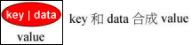

```C++
template<class Key,				// 指定key类型
         class Value,			// 指定Value类型
         class KeyOfValue,		// 仿函数类,指定从Value中获取Key的方式
         class Compare,			// 仿函数类,指定Key的排序方式
         class Alloc = alloc>
class rb_tree {
protected:
    typedef __rb_tree_node <Value> rb_tree_node;
public:
    typedef rb_tree_node *link_type;
protected:
    size_type node_count;	// rb_tree的大小(节点数量)
    link_type header;		// 头节点
    Compare key_compare; 	// Key的排序方式
};
```

`rb_tree`的`header`指向一个多余的空节点,用以维持其前闭后开的特性.

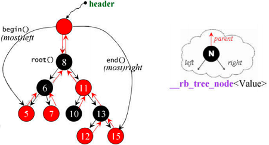

下面程序演示`rb_tree`的使用:
```C++
rb_tree<int, int, identity<int>, less<int>> itree;
cout << itree.empty() << endl; 	// 1
cout << itree.size() << endl; 	// 0
itree.insert_unique(3);
itree.insert_unique(8);
itree.insert_unique(5);
itree.insert_unique(9);
itree.insert_unique(13);
itree.insert_unique(5); 		//no effect, since using insert_unique()
cout << itree.empty() << endl;	//0
cout << itree.size() << endl;	//5
cout << itree.count(5) << endl;	//1
itree.insert_equal(5);
itree.insert_equal(5);
cout << itree.size() << endl; 	//7, since using insert_equal()
cout << itree.count(5) << endl; //3
```


### 容器`set`和`multiset`

容器`set`和`multiset`以`rb_tree`为底层容器,因此其中元素是有序的,排序的依据是`key`.`set`和`multiset`元素的`value`和`key`一致.

`set`和`multiset`提供迭代器`iterator`用以顺序遍历容器,但无法使用`iterator`改变元素值,因为`set`和`multiset`使用的是内部`rb_tree`的`const_iterator`.

`set`元素的`key`必須独一无二,因此其`insert()`调用的是内部`rb_tree`的`insert_unique()`方法;`multiset`元素的`key`可以重复,因此其`insert()`调用的是内部`rb_tree`的`insert_equal()`方法.

```C++
template<class Key,
         class Compare = less<Key>,
         class Alloc = alloc>
class set {
public:
    typedef Key key_type;
    typedef Key value_type;
    typedef Compare key_compare;
    typedef Compare value_compare;
private:
    typedef rb_tree <key_type, 
    				 value_type, 
    				 identity<value_type>, 
    				 key_compare, 
    				 Alloc> rep_type;
    rep_type t;		// 内部rb_tree容器
public:
    typedef typename rep_type::const_iterator iterator;
};
```

`set`容器的模板参数推导过程如下:

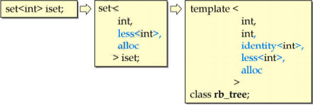

### 容器`map`和`multimap`

容器`map`和`multimap`以`rb_tree`为底层容器,因此其中元素是有序的,排序的依据是`key`.

`map`和`multimap`提供迭代器`iterator`用以顺序遍历容器.无法使用`iterator`改变元素的`key`,但可以用它来改变元素的`data`,因为`map`和`multimap`内部自动将`key`的类型设为`const`.

`map`元素的`key`必須独一无二,因此其`insert()`调用的是内部`rb_tree`的`insert_unique()`方法;`multimap`元素的`key`可以重复,因此其`insert()`调用的是内部`rb_tree`的`insert_equal()`方法.

```C++
template<class Key,
         class T,
         class Compare = less<Key>,
         class Alloc = alloc>
class map {
public:
    typedef Key key_type;
    typedef T data_type;
    typedef T mapped_type;
    typedef pair<const Key, T> value_type;
    typedef Compare key_compare;
private:
    typedef rb_tree <key_type, 
    				 value_type, 
    				 select1st<value_type>, 
    				 key_compare, 
    				 Alloc> rep_type;
    rep_type t;		// 内部rb_tree容器
public:
    typedef typename rep_type::iterator)
    iterator;
};
```

`map`容器的模板参数推导过程如下:

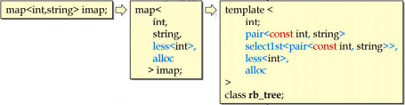

`map`容器重载的`[]`运算符返回对应`data`的引用

```C++
mapped_type& operator[](key_type&& __k)
{
    // 先查找key
    // 若key存在,则直接返回其data的引用
	iterator __i = lower_bound(__k);
    // 若key不存在,则先插入key,再返回对应的引用
    if (__i == end() || key_comp()(__k, (*__i).first))
        __i = _M_t._M_emplace_hint_unique(__i, std::piecewise_construct, std::forward_as_tuple(std::move(__k)), std::tuple<>());
    return (*__i).second;
}
```

### 容器`hashtable`


`hashtable`最开始只有53个桶,当元素个数大于桶的个数时,桶的数目扩大为最接近当前桶数两倍的质数,实际上,桶数目的增长顺序被写死在代码里:

```C++
static const unsigned long __stl_prime_list[__stl_num_primes] = {
        53, 97, 193, 389, 769, 1543, 3079, 6151, 12289, 24593,
        49157, 98317, 196613, 393241, 786433, 1572869, 3145739,
        6291469, 12582917, 25165843, 50331653, 100663319,
        201326611, 402653189, 805306457, 1610612741,
        3221225473ul, 4294967291ul};
```

`hashtable`代码如下:

```C++
template<class Value, 
		 class Key, 
		 class HashFcn,
         class ExtractKey, 
		 class EqualKey,
         class Alloc=alloC>
class hashtable {
public:
    typedef HashFcn 	hasher;
    typedef EqualKey 	key_equal;
    typedef size_t 		size_type;
private:
    hasher hash;
    key_equal equals;
    ExtractKey get_key;
    
    typedef __hashtable_node<Value> node;
    vector<node*, Alloc> buckets;	// 保存桶的vector
    size_type num_elements;
public:
    size_type bucket_count() const { return buckets.size(); }
};

template<class Value>
struct __hashtable_node {
    __hashtable_node *next;
    Value val;
};

template<class Value, class Key, class HashFen, class ExtractKey, class EqualKey, class Alloc>
struct __hashtable_iterator {
    node *cur;
    hashtable *ht;
};
```

下面代码演示`hashtable`的使用:

```C++
hashtable<pair<const string, int>, 
		  string, 
		  hash<string>, 
		  select1st<pair<const string, int>>, 
		  equal_to<string>, 
		  alloc> siht(100, hash<string>(), equal_to<string>());

cout << siht.size() << endl; 							// 0
cout << siht.bucket_count() << endl;					// 193
siht.insert_unique(make_pair(string("jjhou"), 95));
siht.insert_unique(make_pair(string("sabrina"), 90));
siht.insert_unique(make_pair(string("mjchen"), 85));
cout << siht.size() << endl;							// 3
cout << siht.bucket_count() << endl;					// 193
cout << siht.find(string("sabrina"))->second << endl; 	//90
cout << siht.find(string("jjhou"))->second << endl;		//95
cout << siht.find(string("mjchen"))->second << endl;	//85
```

### 容器`unordered_set`、`unordered_multiset`、`unordered_map`和`unordered_multimap`

C++11引入的容器`unordered_set`、`unordered_multiset`、`unordered_map`和`unordered_multimap`更名自gcc2.9的容器`hash_set`、`hash_multiset`、`hash_map`和`hash_multimap`,其底层封装了`hashtable`.用法与`set`、`multiset`、`map`和`multimap`类似.

# STL算法源码分析

STL算法的一般形式如下:

```C++
template<typename Iterator>
Algorithm(Iterator itr1, Iterator itr2) {
    // ...
}

template<typename Iterator, typename Cmp>
Algorithm(Iterator itr1, Iterator itr2, Cmp comp) {
    // ...
}
```

STL算法是看不到容器的,算法所需要的信息都是从**迭代器**取得的,因此迭代器内要存在与容器相关的信息,其中最重要的就是迭代器的5个关联类型.

## 迭代器对算法的影响

### 迭代器的`iterator_category`类型

迭代器的关联类型`iterator_category`表示迭代器类型,共5种,用类表示:`input_iterator_tag`、`output_iterator_tag`、`forward_iterator_tag`、`bidirectional_iterator_tag`和`random_acess_iterator_tag`.

```C++
struct input_iterator_tag {};
struct output_iterator_tag {};
struct forward_iterator_tag : public input_iterator_tag {};
struct bidirectional_iterator_tag : public forward_iterator_tag {};
struct random_access_iterator_tag : public bidirectional_iterator_tag {}:
```

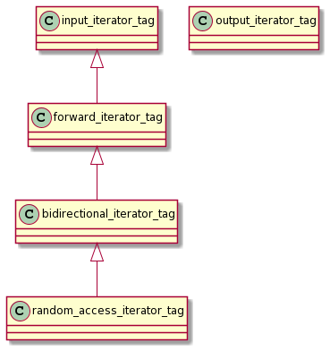

之所以使用类而非枚举来表示迭代器类型,是出于一下两个考虑:

- 使用类的继承可以表示不同迭代器类型的从属关系.
- STL算法可以根据传入的迭代器类型调用不同版本的重载函数.

下面的程序演示这两点.

下面程序用以演示不同容器的迭代器`iterator_category`值:

```C++
// 输出迭代器类型,使用函数重载以应对不同类型的迭代器
void _display_category(random_access_iterator_tag) { cout << "random_access_iterator" << endl; }
void _display_category(bidirectional_iterator_tag) { cout << "bidirectional_iterator" << endl; }
void _display_category(forward_iterator_tag) { cout << "forward_iterator" << endl; }
void _display_category(output_iterator_tag) { cout << "output_iterator" << endl; }
void _display_category(input_iterator_tag) { cout << "input_iterator" << endl; }

template<typename I>
void display_category(I itr) {
    typename iterator_traits<I>::iterator_category cagy;
    _display_category(cagy);
}

// 输出不同容器的迭代器类型
void test_iterator_category() {
    display_category(array<int, 10>::iterator());				// random_access_iterator
    display_category(vector<int>::iterator());					// random_access_iterator
    display_category(list<int>::iterator());					// bidirectional_iterator
    display_category(forward_list<int>::iterator());			// forward_iterator
    display_category(deque<int>::iterator());					// random_access_iterator

    display_category(set<int>::iterator());						// bidirectional_iterator
    display_category(map<int, int>::iterator());				// bidirectional_iterator
    display_category(multiset<int>::iterator());				// bidirectional_iterator
    display_category(multimap<int, int>::iterator());			// bidirectional_iterator
    display_category(unordered_set<int>::iterator());			// forward_iterator
    display_category(unordered_map<int, int>::iterator());		// forward_iterator
    display_category(unordered_multiset<int>::iterator());		// forward_iterator
    display_category(unordered_multimap<int, int>::iterator());	// forward_iterator

    display_category(istream_iterator<int>());					// input_iterator
    display_category(ostream_iterator<int>(cout, ""));			// output_iterator
}
```


容器`array`、`vector`、`deque`对使用者来说是连续空间,是**可以跳跃**的,其迭代器是`random_access_iterator`类型.

容器`list`是双向链表,容器`set`、`map`、`multiset`、`multimap`本身是有序的,他们的迭代器都可以双向移动,因此是`bidirectional_iterator`类型.

容器`forward_list`是单向链表,容器`unordered_set`、`unordered_map`、`unordered_multiset`、`unordered_map`哈希表中的每个桶都是单向链表.因此其迭代器只能单向移动,因此是`forward_iterator`类型.

迭代器`istream_iterator`和`ostream_iterator`本质上是迭代器,后文会提到这两个类的源码.

### `iterator_traits`和`type_traits`对算法的影响

STL种的大部分算法都根据传入的迭代器类型以及其他信息调用不同的重载函数,针对特定的数据结构执行特定的优化

- STL中的算法`distance`根据不同的`iterator_category`执行不同的重载函数

```C++
template<class InputIterator>
inline typename iterator_traits<InputIterator>::diffrence_type
_distance(InputIterator first, InputIterator last, input_iterator_tag) {
    typename iterator_traits<InputIterator>::diffrence_type n = 0;
    while (first != last) {
        ++first;
        ++n;
    }
    return n;
}

template<class RandomAccessIterator>
inline typename iterator_traits<RandomAccessIterator>::difference_type
_distance(RandomAccessIterator first, RandomAccessIterator last, random_access_iterator_tag) {
    return last - first;
}

template<class InputIterator>
inline typename iterator_traits<InputIterator>::difference_type distance(InputIterator first, InputIterator last) {
    typedef typename iterator_traits<InputIterator>::iterator_category category;
    return __distance(first, last, category());
}
```

- STL中的算法`advance`根据不同的`iterator_category`执行不同的重载函数

```C++
template<class InputIterator, class Distance>
inline void __advance(InputIterator &i, Distance n, input_iterator_tag) {
    while (n--) ++i;
}

template<class BidirectionalIterator, class Distance>
inline void __advance(BidirectionalIterator &i, Distance n, bidirectional_iterator_tag) {
    if (n >= 0)
        while (n--) ++i;
    else
        while (n++)--i,
}

template<class RandomAccessIterator, class Distance>
inline void __advance(RandomAccessIterator &i, Distance n, random_access_iterator_tag) {
    i += n;
}

template<class InputIterator, class Distance>
inline void advance(InputIterator &i, Distance n) {
    typedef typename iterator_traits<InputIterator>::iterator_category category;
    _advance(i, n, category());
}
```

- STL中的算法`copy`根据不同的`iterator_category`和`type_traits`执行不同的重载函数

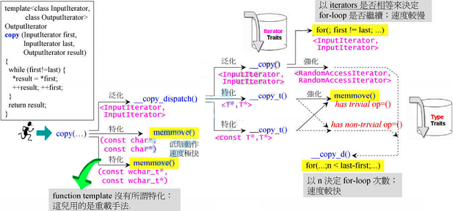

STL算法都是模板函数,无法对传入的`iterator_category`类型做出限定,但源码中的模板参数名还是对接收的`iterator_category`做出了一定的暗示.例如`sort`算法的模板参数类型名设为`RandomAccessIterator`,暗示了该算法只能接收`random_access_iterator_tag`类型的迭代器.

```C++
template<typename RandomAccessIterator>
inline void sort(RandomAccessIterator first, RandomAccessIterator last)
{
    // ...
}
```

## 算法

C语言本身提供了一些算法,如`qsort`,不属于STL算法.STL算法应该满足下面的形式:模板函数,接收参数是迭代器和某些标准.

```C++
template<typename Iterator>
Algorithm(Iterator itr1, Iterator itr2) {
    // ...
}

template<typename Iterator, typename Cmp>
Algorithm(Iterator itr1, Iterator itr2, Cmp comp) {
    // ...
}
```

### 算法`accumulate`

算法`accumulate`的默认运算是`+`,但是重载版本允许自定义运算,支持所有容器,源码如下:

```C++
template<class InputIterator, class T>
T accumulate(InputIterator first, InputIterator last, T init) {
    for (; first != last; ++first)
        init = init + *first;
    return init;
}

template<class InputIterator, class T, class BinaryOperation>
T accumulate(InputIterator first, InputIterator last, T init, BinaryOperation binary_op {
    for (; first != last; ++first)
        init = binary_op(init, *first);
    return init;
}
```

下面程序演示其使用:

```C++
#include <iostream>     // std::cout
#include <functional>   // std::minus
#include <numeric>      // std::accumulate

// 自定义函数
int myfunc(int x, int y) { return x + 2 * y; }

// 自定义仿函数
struct myclass {
    int operator()(int x, int y) { return x + 3 * y; }
} myobj;

int main() {
	int init = 100;
    int nums[] = {10, 20, 30};

    cout << accumulate(nums, nums + 3, init);  				// 使用默认运算`+`,输出160
    cout << accumulate(nums, nums + 3, init, minus<int>()); // 使用仿函数指定运算`-`, 输出40
    cout << accumulate(nums, nums + 3, init, myfunc);    	// 使用自定义函数指定运算, 输出220
    cout << accumulate(nums, nums + 3, init, myobj);    	// 使用四定义仿函数,输出280
    return 0;
}
```

### 算法`for_each`

算法`for_each`支持所有容器,源码如下:

```C++
template<class InputIterator, class Function>
Function for_each(InputIterator first, InputIterator last, Function f) {
    for (; first != last; ++first)
        f(*first);
    return f;
}
```

C++11中引入了新的range-based for语句,形式如下:

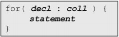

下面程序演示其使用:

```C++
// 自定义函数
void myfunc(int i) { cout << ' ' << i; }

// 自定义仿函数
struct myclass {
    void operator()(int i) { cout << ' ' << i; }
} myobj;

int main() {
    vector<int> myvec = {10, 20, 30};

    for_each(myvec.begin(), myvec.end(), myfunc);	// 使用自定义函数,输出10 20 30
    for_each(myvec.begin(), myvec.end(), myobj);	// 使用自定义仿函数,输出10 20 30

    // C++11引入的range-based for语法
    for (auto &elem : myvec)
        elem += 5;

    for (auto elem : myvec)
        cout << ' ' << elem;    	// 输出15 25 35
	return 0;
}
```

### 算法`replace`、`replace_if`、`replace_copy`

- 算法`replace`将范围内所有等于`old_value`的元素都用`new_value`取代.

- 算法`replace_if`将范围内所有满足`pred()`为`true`的元素都用`new_value`取代.

- 算法`replace_copy`将范围内所有等于`old_value`的元素都以`new_value`放入新区间,不等于`old_value`的元素直接放入新区间.

它们支持所有容器,源码如下:

```C++
template<class ForwardIterator, class T>
void replace(ForwardIterator first, ForwardIterator last, const T &old_value, const T &new_value) {
    // 将范围内所有等于old_value的元素都用new_value取代
    for (; first != last; ++first)
        if (*first == old_value)
            *first = new_value;
}

template<class ForwardIterator, class Predicate, class T>
void replace_if(ForwardIterator first, ForwardIterator last, Predicate pred, const T &new_value) {
	// 将范围内所有满足pred()为true的元素都用new_value取代
    for (; first != last; ++first)
        if (pred(*first))
            *first = new_value;
}

template<class InputIterator, class OutputIterator, class T>
OutputIterator replace_copy(InputIterator first, InputIterator last, OutputIterator result, const T &old_value, const T &new_value) {
	// 将范围内所有等于old_value的元素都以new_value放入新区间,不等于old_value的元素直接放入新区间.
    for (; first != last; ++first, ++result)
        *result = (*first == old_value ? new_value : *first);
    return result;
}
```

### 算法`count`、`count_if`

- 算法`count`计算范围内等于`value`的元素个数.

- 算法`count_if`计算范围内所有满足`pred()`为`true`的元素个数.

它们支持所有容器,但关联型容器(`set`、`map`、`multiset`、`multimap`、`unordered_set`、`unordered_map`、`unordered_multiset`和`unordered_map`)含有更高效的`count`方法,不应使用STL中的`count`函数.源码如下:

```C++
template<class InputIterator, class T>
typename iterator_traits<InputIterator>::difference_type 
count(InputIterator first, InputIterator last, const T &value) {
    // 计算范围内等于value的元素个数
    typename iterator_traits<InputIterator>::difference_type n = 0;
    for (; first != last; ++first) /
        if (*first == value)
            ++n;
    return n;
}

template<class InputIterator, class Predicate>
typename iterator_traits<InputIterator>::difference_type
count_if(InputIterator first, InputIterator last, Predicate pred) {
    // 计算范围内所有满足pred()为true的元素个数
    typename iterator_traits<InputIterator>::difference_type n = 0;
    for (; first != last; ++first)
        if (pred(*first))
            ++n;
    return n;
}
```

### 算法`find`、`find_if`

- 算法`find`查找范围内第一个等于`value`的元素.

- 算法`find_if`查找范围内第一个满足`pred()`为`true`的元素.

它们支持所有容器,但关联型容器(`set`、`map`、`multiset`、`multimap`、`unordered_set`、`unordered_map`、`unordered_multiset`和`unordered_map`)含有更高效的`find`方法,不应使用STL中的`find`函数.源码如下:

```C++
template<class InputIterator, class T>
InputIterator find(InputIterator first, InputIterator last, const T &value) {
    while (first != last && *first != value)
        ++first;
    return first;
}

template<class InputIterator, class Predicate>
InputIterator find_if(InputIterator first, InputIterator last, Predicate pred) {
    while (first != last && !pred(*first))
        ++first;
    return first;
}
```

### 算法`sort`

算法`sort`暗示参数为`random_access_iterator_tag`类型迭代器,因此该算法只支持容器`array`、`vector`和`deque`.

容器`list`和`forward_list`含有`sort`方法.

容器`set`、`map`、`multiset`、`multimap`本身是有序的,容器`unordered_set`、`unordered_map`、`unordered_multiset`和`unordered_map`本身是无序的,不需要排序.

```C++
template<typename RandomAccessIterator>
inline void sort(RandomAccessIterator first, RandomAccessIterator last)
{
    // ...
}
```

下面程序演示其使用:

```C++
// 自定义函数
bool myfunc(int i, int j) { return (i < j); }

// 自定义仿函数
struct myclass {
    bool operator()(int i, int j) { return (i < j); }
} myobj;

int main() {
    
    int myints[] = {32, 71, 12, 45, 26, 80, 53, 33};
    vector<int> myvec(myints, myints + 8);          // myvec内元素: 32 71 12 45 26 80 53 33

    sort(myvec.begin(), myvec.begin() + 4);         // 使用默认`<`运算定义顺序,myvec内元素: (12 32 45 71)26 80 53 33
    sort(myvec.begin() + 4, myvec.end(), myfunc); 	// 使用自定义函数定义顺序,myvec内元素: 12 32 45 71(26 33 53 80)
    sort(myvec.begin(), myvec.end(), myobj);     	// 使用自定义仿函数定义顺序,myvec内元素: (12 26 32 33 45 53 71 80)
    sort(myvec.rbegin(), myvec.rend());				// 使用反向迭代器逆向排序,myvec内元素: 80 71 53 45 33 32 26 12
    return 0;
}
```

上面程序中的`rbegin`和`rend`是迭代器适配器,生成一个逆向增长的迭代器,后文会提到这两个类的源码.

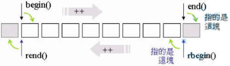

### 算法`binary_search`

算法`binary_search`从排好序的区间内查找元素`value`,支持所有可排序的容器.

算法`binary_search`内部调用了算法`lower_bound`,使用二分查找方式查询元素.

算法`lower_bound`和`upper_bound`分别返回对应元素的第一个和最后一个**可插入位置**.

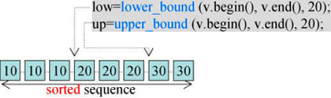

```C++
template<class ForwardIterator, class T>
bool binary_search(ForwardIterator first, ForwardIterator last, const T &val) {
    first = std::lower_bound(first, last, val);		// 内部调用lower_bound
    return (first != last && !(val < *first));
}

template<class ForwardIterator, class T>
ForwardIterator lower_bound(ForwardIterator first, ForwardIterator last, const T &val) {
    ForwardIterator it;
    typename iterator_traits<ForwardIterator>::difference_type count, step;
    count = distance(first, last);
    while (count > 0) {
        it = first;
        step = count / 2;
        advance(it, step);
        if (*it < val) { // or: if (comp(*it,val)) for version (2)
            first = ++it;
            count -= step + 1;
        } else
            count = step;
        return first;
    }
}
```


# STL仿函数源码分析

仿函数是一类重载了`()`运算符的类,其对象可当作函数来使用,常被用做STL算法的参数.

STL的所有仿函数都必须继承自基类`unary_function`或`binary_function`,这两个基类定义了一系列关联类型,这些关联类型可被STL适配器使用.为了扩展性,我们自己写的仿函数也应当继承自这两个基类之一.

```C++
template<class Arg, class Result>
struct unary_function {
    typedef Arg argument_type;			// 关联类型1
    typedef Result result_type;			// 关联类型2
};

template<class Argl, class Arg2, class Result>
struct binary_function {
    typedef Argl first_argument_type;	// 关联类型1
    typedef Arg2 second_argument_type;	// 关联类型2
    typedef Result result_type;			// 关联类型3
};
```

前文程序中用到的几个仿函数的源码如下:

```C++
// 算术运算类仿函数
template<class T>
struct plus : public binary_function<T, T, T> {
    T operator()(const T &x, const T &y) const { return x + y; }
};

template<class T>
struct minus : public binary_function<T, T, T> {
    T operator()(const T &x, const T &y) const { return x - y; }
};

// 逻辑运算类仿函数
template<class T>
struct logical_and : public binary_function<T, T, bool> {
    bool operator()(const T &x, const T &y) const { return x && y; }
};

// 相对关系类仿函数
template<class T>
struct equal_to : public binary_function<T, T, bool> {
    bool operator()(const T &x, const T &y) const { return x == y; }
};

template<class T>
struct less : public binary_function<T, T, bool> {
    bool operator()(const T &x, const T &y) const { return x < y; }
}
```

前文程序中我们自定义的仿函数并没有继承自基类`unary_function`或`binary_function`,这样虽然能够运行,但是不好,因为没有继承自基类的仿函数无法与STL其他组件(尤其是**函数适配器**)结合起来.

# STL适配器源码分析

## 容器适配器

STL中:

- 容器`stack`和`queue`是容器`deque`的适配器.
- 容器`set`、`map`、`multiset`和`multimap`是容器`rb_tree`的适配器.
- 容器`unordered_set`、`unordered_multiset`、`unordered_map`和`unordered_multimap`是容器`hashtable`的适配器.

上述源码在前文中均已分析过.
## 仿函数适配器

### 仿函数适配器`binder2nd`及其辅助函数`bind2nd`

仿函数适配器`binder2nd`可以绑定二元仿函数的第二参数,生成新的仿函数.其源码如下:

```C++
// 放函数适配器binder2nd也是仿函数类,因此继承自仿函数基类unary_function
template<class Operation>
class binder2nd : public unary_function<typename Operation::first_argument type,
        								typename Operation::result_type> {
protected:
	// 内部成员,分别记录运算和第二实参
    Operation op;	
    typename Operation::second_argument_type value;
public:
	// 构造函数,将运算和第二实参记录下来
    binder2nd(const Operation &x, const typename Operation::second_argument_type &y)
            : op(x), value(y) {} 	
	// 重载()运算符,传入第二参数
    typename Operation::result_type operator()(const typename Operation::first_argument_type &x) const {
        return op(x, value);
    }
}
```

在`binder2nd`源码中,调用了`Operation`类的`first_argument`、`second_argument_type`和`result_type`,这些字段都是从STL仿函数基类`binary_function`继承得到的.因此我们自己写的仿函数也要继承自基类`binary_function`,才能使用适配器`binder2nd`进行增强.

`binder2nd`适配器增强得到的仍然是一个仿函数,因此也要继承基类`unary_function`,以便被其它适配器增强.

使用类模板时必须指定模板参数的取值,因此将`binder2nd`封装进函数`bind2nd`中,使用函数模板的参数推导功能,简化代码:

```C++
// 辅助函数
template<class Operation, class T>
inline binder2nd<Operation> bind2nd(const Operation &op, const T &x) {
    typedef typename Operation::second_argument_type arg2_type;
    // 传给bind2nd函数的第二参数必须能够转为Operation的第二参数类型,否则报错
    return binder2nd<Operation>(op, arg2_type(x));
}
```

这样就可以像前文例子中那样使用`bind2nd`了:

```C++
cout << count_if(vi.begin(), vi.end (), bind2nd(less<int>(), 40));
```

### 仿函数适配器`unary_negate`及其辅助函数`not1`

仿函数适配器`unary_negate`将仿函数的结果取反,生成新的仿函数.其源码如下:

```C++
// 仿函数适配器unary_negate也是仿函数类,因此继承自仿函数基类unary_function
template<class Predicate>
class unary_negate : public unary_function<typename Predicate::argument_type, bool> {
protected:
    // 内部成员,记录被取反的仿函数
    Predicate pred;		
public:
    // 构造函数使用explicit修饰,避免隐式类型转换 
    explicit unary_negate(const Predicate &x) : pred(x) {}		
	
    // 重载()运算符,将函数结果取反
    bool operator()(const typename Predicate::argument_type &x) const {
        return !pred(x);
    }
};

// 辅助函数
template<class Predicate>
inline unary_negate<Predicate> not1(const Predicate &pred) {
    return unary_negate<Predicate>(pred);
}
```

这样就可以像前文例子中那样使用`not1`了:

```C++
cout << count_if(vi.begin(), vi.end (), not1(bind2nd(less<int>(), 40)));
```

### 仿函数适配器`bind`

在库文件`include/c++/backward/backward_warning.h`中列出了一系列C++11中废弃了的STL类及其替代类.

| 被废弃的类及其头文件位置 | 替代类及其头文件位置 |
| :----: | :----: |
| `<strstream>`, strstreambuf | `<sstream>`, basic_stringbuf |
| `<strstream>`, istrstream | `<sstream>`, basic_istringstream |
| `<strstream>`, ostrstream | `<sstream>`, basic_ostringstream |
| `<strstream>`, strstream | `<sstream>`, basic_stringstream |
| `<ext/hash_set>`, hash_set | `<unordered_set>`, unordered_set |
| `<ext/hash_set>`, hash_multiset | `<unordered_set>`, unordered_multiset |
| `<ext/hash_map>`, hash_map | `<unordered_map>`, unordered_map |
| `<ext/hash_map>`, hash_multimap | `<unordered_map>`, unordered_multimap |
| `<functional>`, binder1st | `<functional>`, bind |
| `<functional>`, binder2nd | `<functional>`, bind |
| `<functional>`, bind1st | `<functional>`, bind |
| `<functional>`, bind2nd | `<functional>`, bind |
| `<memory>`, auto_ptr | `<memory>`, unique_ptr |

其中用于绑定函数参数的类`binder1st`和`binder2nd`及其辅助函数`bind1st`和`bind2nd`都被替换为功能更强大的`bind`.

函数`bind`要和命名空间`std::placeholders`中的占位符`_1`、`_2`、`_3`…等占位符配合使用.`bind`函数可以绑定:

- 函数和函数对象.
- 成员函数(绑定成员函数时占位符`_1`必须是该类对象的地址).
- 成员变量(绑定成员变量时占位符`_1`必须是该类对象的地址).

下面程序演示其使用:
```c++
#include <iostream>     // std::cout
#include <functional>   // std::bind

double my_divide(double x, double y) { return x / y; }

struct MyPair {
    double a, b;
    double multiply() { return a * b; }
};

int main() {
    using namespace std::placeholders;    // 引入占位符_1, _2, _3,...

    // 将10和2绑定到函数的第一参数和第二参数上
    auto fn_five = std::bind(my_divide, 10, 2);               // returns 10/2
    std::cout << fn_five() << '\n';                          // 5

    // 将2绑定到函数的第一参数上
    auto fn_half = std::bind(my_divide, _1, 2);               // returns x/2
    std::cout << fn_half(10) << '\n';                        // 5

    // 将函数的第一参数和第二参数绑定到第二参数和第一参数上
    auto fn_invert = std::bind(my_divide, _2, _1);            // returns y/x
    std::cout << fn_invert(10, 2) << '\n';                    // 0.2

    // 将int绑定到函数的返回值上
    auto fn_rounding = std::bind<int>(my_divide, _1, _2);     // returns int(x/y)
    std::cout << fn_rounding(10, 3) << '\n';                  // 3

    MyPair ten_two{10, 2};

    // 将对象ten_two绑定到函数的第一参数上
    auto bound_member_fn = std::bind(&MyPair::multiply, _1); // returns x.multiply()
    std::cout << bound_member_fn(ten_two) << '\n';           // 20
	
    // 将对象ten_two绑定到函数的成员变量上
    auto bound_member_data = std::bind(&MyPair::a, ten_two); // returns ten_two.a
    std::cout << bound_member_data() << '\n';                // 10

    return 0;
}
```

## 迭代器适配器

### 逆向迭代器`reverse_iterator`

容器的`rbegin()`和`rend()`方法返回逆向迭代器`reverse_iterator`,逆向迭代器的方向与原始迭代器相反.

```c++
class container{
public:
	reverse_iterator rbegin() { 
        return reverse_iterator(end()); 
    }
	
    reverse_iterator rend() {
        return reverse_iterator(begin()); 
    }
    
    // ...
}
```

逆向迭代器适配器`reverse_iterator`与正常迭代器的方向正好相反:逆向迭代器的尾(头)就是正向迭代器的头(尾);逆向迭代器的加(减)运算就是正向迭代器的减(加)运算.因此逆向迭代器取值时取得是迭代器前面一格元素的值.

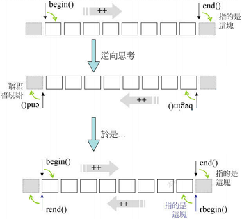

`reverse_iterator`源码如下:

```c++
template<class Iterator>
class reverse_iterator {
protected:
    Iterator current;			// 对应的正向迭代器
public:
	// 逆向迭代器的5种关联类型与正向迭代器相同
    typedef typename iterator_traits<Iterator>::itrator_category iterator_category;
    typedef typename iterator_traits<Iterator>::value_type value_type;
	// ...
    typedef Iterator iterator_type;				// 正向迭代器类型
    typedef reverse_iterator<Iterator> self;	// 逆向迭代器类型
public:
    explicit reverse_iterator(iterator_type x) : current(x) {}
    reverse_iterator(const self &x) : current(x.current) {}
    iterator_type base() const { return current; } 
    
    // 逆向迭代器取值: 就是将迭代器视为正向迭代器,退一格再取值
    reference operator*() const {
        Iterator tmp = current;
        return *--tmp;
    }

    pointer operator->() const { return &(operator*()); } 
    
    // 逆向迭代器的加运算对应正向迭代器的减运算
    self &operator++() { --current;return *this; }
    self &operator--() { ++current;return *this; }
    self operator+(difference_type n) const { return self(current - n); }
    self operator-(difference_type n) const { return self(current + n); }
};
```

### 用于插入的迭代器`insert_iterator`及其辅助函数`inserter`

迭代器适配器`insert_iterator`生成用于原地插入运算的迭代器,使用`insert_iterator`迭代器插入元素时,就将原有位置的元素向后推.

```c++
list<int> foo = {1, 2, 3, 4, 5};
list<int> bar = {10, 20, 30, 40, 50};

list<int>::iterator it = foo.begin();
advance(it, 3);

copy(bar.begin(), bar.end(), inserter(foo, it));
```

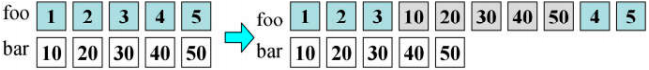

`insert_iterator`通过重载运算符`=`、`*`和`++`实现上述功能:

```C++
// 适配器类insert_iterator
template<class Container>
class insert_iterator {
protected:
    // 内部成员,记录底层容器和迭代器
    Container *container; 
    typename Container::iterator iter;
public:
    // 定义5个关联类型
    typedef output_iterator_tag iterator_category; 	
    
    insert_iterator(Container &x, typename Container::iterator i)
            : container(&x), iter(i) {}

    // 重载赋值运算符=
    insert_iterator<Container> &
	operator=(const typename Container::value_type &value) {
        iter = container->insert(iter, value); 		// 调用底层容器的insert
        ++iter; 									// 令insert_iterator永远随其target同步移动
        return *this;
    }
    
	// 重载运算符*和++: 不做任何动作
    insert_iterator<Container> &operator*() { return *this; }
    insert_iterator<Container> &operator++() { return *this; }
    insert_iterator<Container> &operator++(int) { return *this; }
};

// 辅助函数inserter
template<class Container, class Iterator>
inline insert_iterator<Container> inserter(Container &x, Iterator i) {
    typedef typename Container::iterator iter;
    return insert_iterator<Container>(x, iter(i));
}
```

### 输出流迭代器`ostream_iterator`

输出流迭代器`ostream_iterator`常用于封装`std::cout`.下面程序将容器中元素输出到`std::cout`中.

```C++
int main() {
    std::vector<int> myvector = {10, 20, 30, 40, 50, 60, 70, 80, 90};
    std::ostream_iterator<int> out_it(std::cout, ",");
    std::copy(myvector.begin(), myvector.end(), out_it);
    return 0;
}
```

`ostream_iterator`重载了运算符`=`,`*`和`++`,其源码如下:

```C++
template<class T, class charT=char, class traits =char_traits<charT> >
class ostream_iterator : public iterator<output_iterator_tag, void, void, void, void> {
    basic_ostream<charT, traits> *out_stream;
    const charT *delim;
public:
    typedef charT char_type,
    typedef traits traits_type,
    typedef basic_ostream<charT, traits> ostream_type;

    ostream_iterator(ostream_type &s) : out_stream(&s), delim(0) {}
    ostream_iterator(ostream_type &s, const charT *delimiter)
            : out_stream(&s), delim(delimiter) {}
    ostream_iterator(const ostream_iterator<T, charT, traits> &x)
            : out_stream(x.out_stream), delim(x.delim) {}
	
    // 重载运算符=: 执行输出
    ostream_iterator<T, charT, traits> &operator=(const T &value) {
        *out_stream << value;
        if (delim != 0) 
            *out_stream << delim;
        return *this;
    }

    // 重载运算符*和++: 不做任何动作
    ostream_iterator<T, charT, traits> &operator*() { return *this; }
    ostream_iterator<T, charT, traits> &operator++() { return *this; }
    ostream_iterator<T, charT, traits> &operator++(int) { return *this; }
};
```

### 输入流迭代器`istream_iterator`

输入流迭代器`istream_iterator`用于封装`std::cin`,下面程序从`std::in`中读取数据:

```C++
std::istream_iterator<double> eos; 				// 标志迭代器,通过与该迭代其比较以判断输入流是否终止
std::istream_iterator<double> iit(std::cin); 	// 封装std::cin的输入流迭代器

double value;
if (iit != eos) 
    value = *iit;		// 从输入流读取数据到变量value中,相当于: std::cin >> cvalue
```

`istream_iterator`重载了运算符`=`,`*`和`++`,其源码如下:

```C++
template<class T, class charT=char, class traits=char_traits<charT>, class Distance=ptrdiff_t>
class istream_iterator :
        public iterator<input_iterator_tag, T, Distance, const T *, const T &> {
    basic_istream<charT, traits> *in_stream;	// 输入流
    T value;									// 上一次读入的值
public:
    typedef charT char_type;
    typedef traits traits_type;
    typedef basic_istream<charT, traits> istream_type;

    istream_iterator() : in_stream(0) {}							// 空迭代器,表示输入流终止
    istream_iterator(istream_type &s) : in_stream(&s) { ++*this; }	// 创建好迭代器后马上读入一个值 
    istream iterator(const istream_iterator<T, charT, traits, Distance> &x)
            : in_stream(x.in_stream), value(x.value) {}

    // 重载运算符++
    istream_iterator<T, charT, traits, Distance> &operator++() {
        if (in_stream && !(*in_stream >> value)) 
            in_stream = 0;
        return *this;
    }
	istream_iterator<T, charT, traits, Distance> operator++(int) {
        istream_iterator<T, charT, traits, Distance> tmp = *this;
        ++*this;
        return tmp;
    }
    
	// 重载运算符*和->
    const T &operator*() const { return value; }
    const T *operator->() const { return &value; }
};
```

下面程序使用输入流迭代器`istream_iterator`从`std::cin`中读取数据到容器中:

```C++
istream_iterator<int> iit(cin), eos;
copy(iit, eos, inserter(c, c.begin()));
```

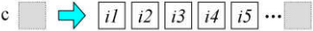

# 其它标准库相关的话题

## 容器`tuple`

### 使用`tuple`

```c++
// 创建tuple
tuple<string, int, int, complex<double> > t;
tuple<int, float, string> t1(41, 6.3, "nico");	// 指定初值
auto t2 = make_tuple(22, 44, "stacy");			// 使用make_tuple函数创建tuple

// 使用get<>()函数获取tuple内的元素
cout << "t1:" << get<0>(t1) << "<< get<1>(t1)<<" << get<2>(t1) << endl;
get<1>(t1) = get<1>(t2);		// 获取的元素是左值,可以对其赋值


// tuple可以直接进行比较
if (t1 < t2) { 
    cout << "t1 < t2" << endl;
} else {
    cout << "t1 >= t2" << endl;
}

// 可以直接拷贝构造
t1 = t2; 

// 使用tie函数将tuple的元素绑定到变量上
tuple<int, float, string> t3(77, 1.1, "more light");
int i1, float f1; string s1;
tie(i1, f1, s1) = t3; 

// 推断 tuple 类型
typedef decltype(t3) TupleType;		// 推断出 t3 的类型为 tuple<int, float, string>

// 使用 tuple_size 获取元素个数
cout << tuple_size<TupleType>::value << endl; 		// 3
// 使用 tuple_element 获取元素类型
tuple_element<1, TupleType>::type fl = 1.0; 		// float
```

### `tuple`类源码分析

容器`tuple`的源码使用可变模板参数,递归调用不同模板参数的tuple构造函数,以处理任意多的元素类型.

```c++
// 定义 tuple类
template<typename... Values>
class tuple;

// 特化模板参数: 空参
template<>
class tuple<> {};

// 特化模板参数
template<typename Head, typename... Tail>
class tuple<Head, Tail...> :
        private tuple<Tail...>        	// tuple类继承自tuple类,父类比子类少了一个模板参数
{
    typedef tuple<Tail...> inherited;	// 父类类型  
protected:
    Head m_head;						// 保存第一个元素的值
public:
    tuple() {}
    tuple(Head v, Tail... vtail)		// 构造函数: 将第一个元素赋值给m_head,使用其他元素构建父类tuple
		: m_head(v), inherited(vtail...) {}

    Head head() { return m_head; }		// 返回第一个元素值
    inherited &tail() { return *this; }	// 返回剩余元素组成的tuple(将当前元素强制转换为父类类型)
};
```

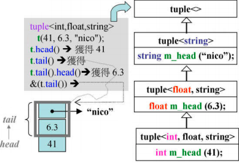

调用`head`函数返回的是元素`m_head`的值.

调用`tail`函数返回父类成分的起点,通过强制转换将当前`tuple`转换为父类`tuple`,丢弃了元素`m_head`所占内存.

## type traits

**类型萃取**机制(type traits)获取与类有关的信息,在C++11之前和C++11中分别由不同的实现方式.

### C++11之前的类型萃取机制:`__type_traits`

在C++11之前,类型萃取机制是由`__type_traits`实现的.我们每创建一个类,就要以该类为模板参数特化一个`__type_traits`类.

```c++
template<class type>
struct __type_traits {
    typedef __false_type has_trivial_default_constructor;   // 默认构造函数是否可忽略
    typedef __false_type has_trivial_copy_constructor;      // 拷贝构造函数是否可忽略
    typedef __false_type has_trivial_assignment_operator;   // 赋值函数是否可忽略
    typedef __false_type has_trivial_destructor;            // 析构函数是否可忽略
    typedef __false_type is_POD_type;                       // 是否是POD(plain old data)类型
};

template<>
struct __type_traits<int> {
    typedef __true_type has_trivial_default_constructor;
    typedef __true_type has_trivial_copy_constructor;
    typedef __true_type has_trivial_assignment_operator;
    typedef __true_type has_trivial_destructor;
    typedef __true_type is_POD_type;
};

template<>
struct __type_traits<double> {
    typedef __true_type has_trivial_default_constructor;
    typedef __true_type has_trivial_copy_constructor;
    typedef __true_type has_trivial_assignment_operator;
    typedef __true_type has_trivial_destructor;
    typedef __true_type is_POD_type;
};

struct __true_type { /*...*/ };
struct __false_type { /*...*/ };
```

这种实现方式比较麻烦,因此C++11以一种新的方式引入`type traits`机制.

### C++11中的类型萃取机制:辅助类

C++11在头文件`type_traits`中引入了一系列辅助类,这些辅助类能根据传入的模板参数自动进行获取该类的基本信息,实现类型萃取,并不需要我们为自己创建的类手动编写类型萃取信息.

官方网站上列出了所有用于类型萃取的辅助函数:

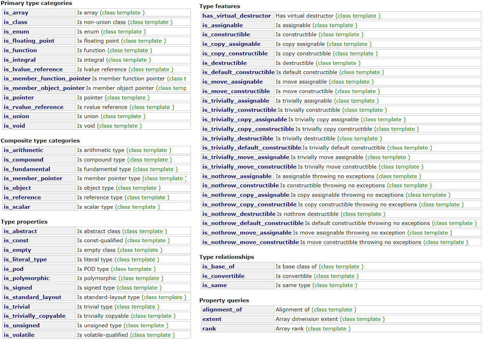

下面例子展示类型萃取机制的应用:

```c++
cout << "is_ void\t" << is_void<T>::value << endl;
cout << "is_ integral\t" << is_integral<T>::value << endl;
cout << "is_ floating point\t" << is_floating_point<T>::value << endl;
// ...
```

### 类型萃取机制源码分析

头文件`type_traits`中定义了辅助类`remove_const`和`remove_volatile`用于除去类型中的`const`和`volatile`关键字.

```c++
// remove const
template<typename _Tp>
struct remove_const {
    typedef _Tp type;
};
template<typename _Tp>
struct remove_const<_Tp const> {
    typedef _Tp type;
};

// remove volatile
template<typename _Tp>
struct remove_volatile {
    typedef _Tp type;
};
template<typename _Tp>
struct remove_volatile<_Tp volatile> {
    typedef _Tp type;
};
```

`is_void`类继承自`__is_void_helper`类,`__is_void_helper`类使用偏特化的形式判断传入的模板参数是否为`void`.

```c++
template<typename>
struct __is_void_helper
	: public false_type {
};

template<>
struct __is_void_helper<void>
	: public true_type {
};

template<typename _Tp>
struct is_void
	: public __is_void_helper<typename remove_cv<_Tp>::type>::type {
};
```

`is_integral`类继承自`__is_integral_helper`类,同样使用偏特化的方式判断传入的模板参数是否为整数类型

```c++
template<typename>
struct __is_integral_helper : public false_type { };

template<> struct __is_integral_helper<bool> : public true_type { };
template<> struct __is_integral_helper<char> : public true_type { };
template<> struct __is_integral_helper<signed char> : public true_type { };
template<> struct __is_integral_helper<unsigned char> : public true_type { };
// ...

template<typename _Tp>
struct is_integral
	: public __is_integral_helper<typename remove_cv<_Tp>::type>::type { };
```

一些type traits辅助类(如`is_enum`、`is_union`和`is_class`等)是由编译器实现的,STL源码中找不到其实现函数.

```c++
// is_enum
template<typename _Tp>
struct is_enum
	: public integral_constant<bool, __is_enum(_Tp)>    // __is_enum函数是由编译器实现的,STL源码中找不到其源码
{ };

// is_union
template<typename _Tp>
struct is_union
	: public integral_constant<bool, __is_union(_Tp)>    // __is_union函数是由编译器实现的,STL源码中找不到其源码
{ };

// is_class
template<typename _Tp>
struct is_class
	: public integral_constant<bool, __is_class(_Tp)>    // __is_class函数是由编译器实现的,STL源码中找不到其源码
{ };
```
