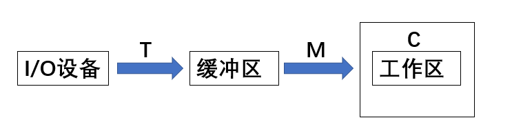
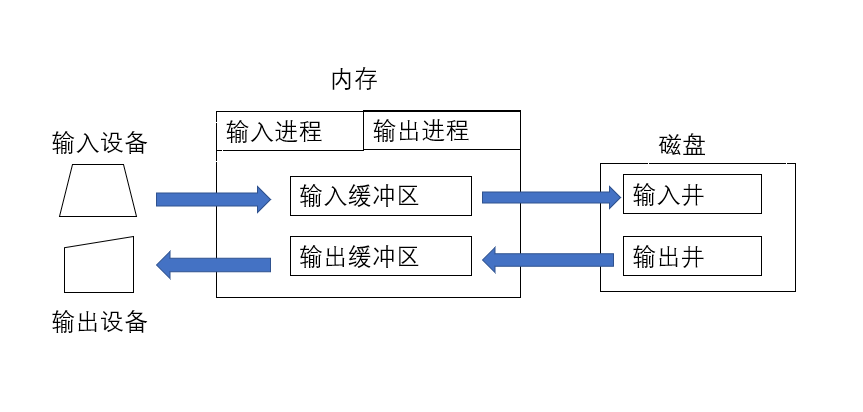
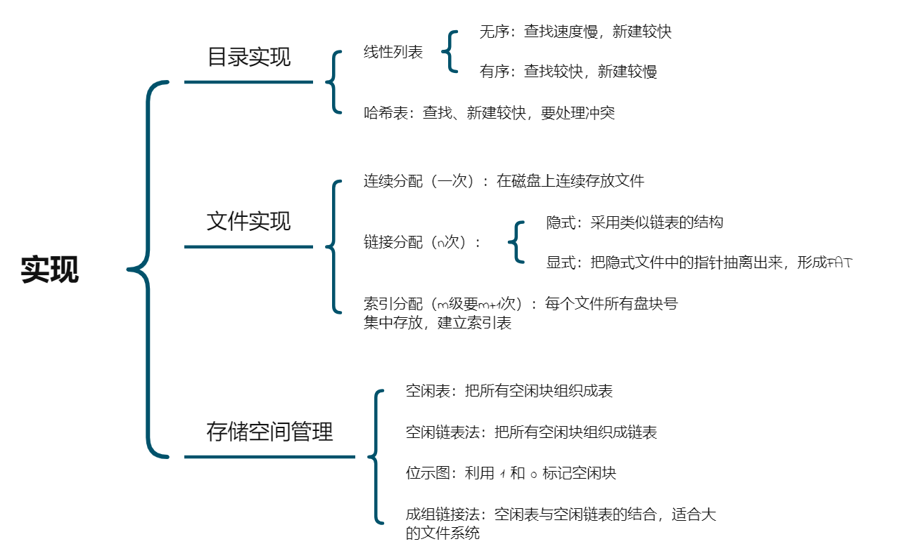
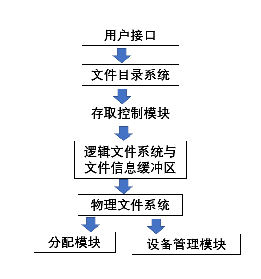
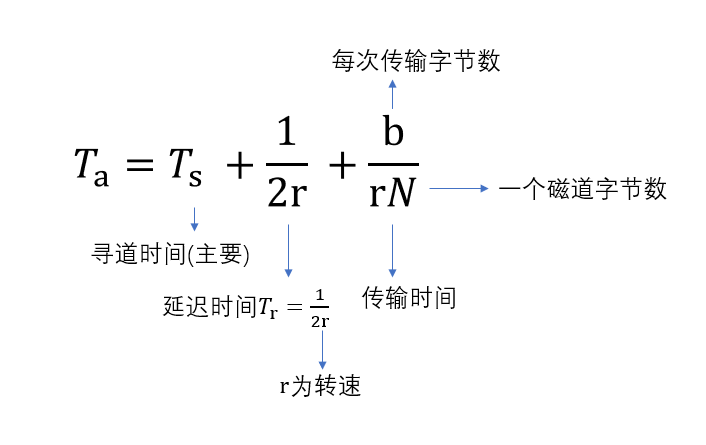

# 进程

## 琐碎的知识点

- 线程是独立调度的基本单位(不拥有系统资源)
进程是拥有资源的基本单位

- 进程实体包括：程序段、相关数据段、PCB

- 周转时间 = 作业`完成`时间 - 作业`提交`时间(即进入内存的时间)
等待时间 = 周转时间 - 执行时间大小
带权周转时间 = 作业周转时间 / 作业实际运行时间

<!-- more -->

## 软件实现互斥的方法：

1. 单标志法(违背空闲让进)

    产生的问题：两个进程 p1，p2交替访问(严格的交替)，若p1访问完成后，想要再访问的话，必须等p2访问一次，否则p1无法访问

2. 双标志先检查法(违背忙则等待)

    产生的问题： 不是原子操作，两个进程同时访问

3. 双标志后检查法(违背空闲让进，有限等待)

    产生的问题： 两个进程同时没标志 true，结果都不能访问资源，导致饥饿

4. Peterson算法(违背让权等待)

    产生的问题： 不能及时释放处理机

## PV操作

P操作：相当于申请资源

``` C++
void wait(semaphore S) {
    S.value--;
    // 当小于零时，说明没有资源了，让这个进程去阻塞队列
    // 等待其他进程释放资源
    if(S.value < 0) {
        // 加入阻塞队列
        block(S.L);
    }
}
```

V操作：相当于释放资源

``` C++
void signal(semaphore S) {
    S.value++;
    // 释放了资源还是小于等于零，
    // 说明有进程在阻塞队列中，唤醒一个
    if(s.value <= 0) {
        wakeup(P);
    }
}
```

利用信号量实现同步时，信号量的初始值为零
当实现资源互斥时，初始值为资源数

## 管程的基本特性

- 局部于管程的数据只能被局部于管程的过程所访问
- 一个进程只有通过管程只有调用管程内的过程才能进入管程访问共享数据
- 每次仅允许一个进程在管程内执行某个内部过程

管程实质上是一个抽象类，无需程序员关注

## 死锁的必要条件

1. 互斥条件

    预防：所有资源都能共享使用 ---> 显然不太可行

2. 不可剥夺条件

    预防：请求新资源而得不到满足时，必须释放所有保持的资源 ---> 常用于状态易于保存恢复的资源

3. 请求和保持

    预防：一次申请所有全部资源 ---> 严重浪费，导致“饥饿”

4. 循环等待

    预防：顺序资源分配，按编号递增的顺序请求资源，同类资源一次申请完 ---> 1、限制新类型设备的添加 2、资源浪费

## 银行家算法

可利用资源矢量 Available   ---> 各类资源数
最大需求矩阵 Max           ---> 所需资源的最大数
分配矩阵 Allocation        ---> 已分配的资源数
需求矩阵 Need              ---> 尚需的各类资源数

Need = Max - Allocation

步骤：

1. 求 Available 向量， Need 矩阵
2. 从 Need 中找到小于 Available 的行Pi
3. Available + Pi
4. 重复步骤2直到 Need 无

## 死锁定理

分配图不可完全简化 ---> 死锁

# 内存管理

编译  ---> 链接 ---> 装入

## 链接

- 静态链接
- 装入时动态链接
- 运行时动态链接

## 装入

- 绝对装入(逻辑地址与实际内存地址完全相同)
- 可重定向装入
- 动态运行时装入(需要一个重定位寄存器)

## 交换与覆盖

- 交换技术对于不同的进程/作业而言
- 覆盖技术则是对于一个程序或者进程而言

## 连续分配管理

### 单一连续分配

1. 分为系统区和用户区
2. 简单、无外部碎片、覆盖技术
3. 只用于单用户、单任务，有内部碎片，存储器利用率极低

### 固定分区分配

1. 若分区大小相等  ---> 缺乏灵活度
2. 分区也可以不相等
3. 会产生内部碎片，无外部碎片

### 动态分区分配

1. 会产生外部碎片，可以采用紧凑技术

2. 分配策略
    - 首次适应，以地址递增  ---> 最好最快
    - 最佳适应，按容量递增  ---> 最差，产生许多外部碎片
    - 最坏适应，按容量递减  ---> 很快无内存可用
    - 邻近适应，循环首次适应，从上次查找的位置开始继续查找

##  非连续分配管理方式

### 基本分页式

- 不产生外部碎片，每个进程平均产生半个块大小的内部碎片
- 进程中的块称为页，内存中的块称为页框，外存中的块就叫做块
- 逻辑地址结构如下
    ```
    31——————————12—11———————0
    |_____________|_________|
        页号         页内偏移

    ```
 - 页表：为每个进程建立，为了便于找到该程序所拥有的页在内存中的物理块
 - 页表中中的每一项称为页表项
    1. 第一部分为：页号(这一部分与逻辑地址第一部分相同)
    2. 第二部分为：物理内存中的块号(页框号)
    在内存中，物理地址 = 块号 + 页内偏移

- 地址变换
    - 页表寄存器(PTR)存页表在内存的起始地址F和页表长度M
    - 若页面大小为L：
        步骤：
        1) 页号P = A/L
           页内偏移 W = A%L
        2) 判断是否越界
        3) 页表项地址 = F +  P*页表项长度(不是M)
        4) 物理地址E = b*L + W

- 页式管理的地址空间是一维的
- 快表(TLB)是一个高速缓冲寄存器，存有部分页表项，可以使得由原来的两次访存变为一次访存
- 2级页表中规定：顶级页表只能有一个页面(即只有一个页块框大小)

### 基本分段方式

- 从用户的角度出发的管理方式，段内连续，段间不连续
- 逻辑地址结构：
     ```
    31————————————16—15——————————————0
    |_______________|________________|
          段号S          段内偏移W
    ```
- 段表：每个进程都有一张逻辑空间与内存空间映射的段表
  段表项如下
  ```
   ———————————————————————————————————————————
  |_________|________|________________________|
     段号      段长    本段在主存中的起始地址    
  ```

- 地址变换机构：

    1. 在逻辑地址中取段号S，段内偏移W
    2. 在段表寄存器中取段表起始地址F和段表长度M
       比较段号S与段表长度M，若S >= M，则越界
    3. 段表中，段号S的段表地址 = F + S*段表项长度
       取得段表项中的记录：段长C和基址b，判断C与W是否越界
    4. 物理地址E = b + W

- 不能修改的代码称为纯代码或可重入代码
- 段式管理的地址空间是二维的

### 段页式管理方式

- 逻辑结构：
    ```
     _________________________________
    |________|_________|______________|
       段号S     页号P    页内偏移量W
    ```
- 操作系统会给每一个进程设一个段表，多个页表
- 一个段表项代表一个页表
- 段表项：段号、页表长度、页表起始地址(为了找哪一个页表)
  页表项：页号、块号
- 地址变换机构
    1. 通过段表找页表起始地址
    2. 通过页表找页帧号
    3. 形成物理地址
- 三次访存，地址空间二维

## 虚拟内存管理

- 请求分页管理方式：
   页表项结构如下：
   ```
     ________________________________________________________
    |____|______________|_________|__________|_______|_______|
     页号  物理块号(内存)  状态位P   访问字段A  修改位M 外存地址
    ```

- 地址变换： 略(TAT)
- 置换算法
    1. 最佳置换算法(OPT)
        - 理想状态，无法实现，可用于评价其他算法
        - 往后看，替换的是最久不使用页
    2. 先进先出(FIFO)
        - 看成队列，换队头(最早进入内存的页)
        - 会出现 Belady 异常
    3. 最近最久未使用(LRU)
        - 最近访问的永远放最下面(最近最长时间未访问)
        - 性能较好
    4. CLOCK 时钟置换(NRU, 最近未用)
        - 设使用位，跳过置0，使用位置1，换0页面
        - 改进型： 设访问位(使用位)和修改位 ---> 1.换(0,0)---->2.换(0,1)--->3.步骤2跳过的让使用位/访问位为0

- 分配策略：
    1. 固定分配局部置换：每个进程分配的物理块一定
    2. 可变分配全局置换：一开始分配一定。后来动态增加(只加不减)
    3. 可变分配局部置换：可增加可减少

- 何处调页
    1. 对换区够多：全部从对换区换，所有相关的提前放对换区
    2. 对换区少：不修改的从文件区换，修改的从对换区换
    3. UNIX方式：一开始全部从文件区(离散分配方式)换，换出的放对换区(连续分配方式)

# I/O管理

## 概述

### I/O控制方式：
   
- 程序直接控制(CPU轮询)
- 中断驱动方式(每次读一个字)
- DMA 方式：
    - 基本单位是数据块
    - 设备与内存互传
    - 传送整个数据块，每次传一个字(此时不需要CPU参与)
    - 寄存器：
        1.  命令/状态寄存器(CR)
        2. 内存地址寄存器(MAR)
        3. 数据寄存器(DR)
        4. 数据计数器(DC)
- 通道控制方式：
    - 一组数据块
    - 与CPU共享内存
    - 指令类型单一
    - 可控制多台设备

### I/O子系统层次

用户层I/O软件
设备独立性软件
设备驱动程序
中断处理程序
硬件

其中硬件部分包括：机械部件(本身)以及电子部件(即设备控制器)
设备控制器又包括：

- 与CPU的接口
- 与设备的接口
- I/O控制逻辑

## 核心子系统

### 缓冲区
                        


#### 单缓冲

每块数据用时Max(C, T) + M

#### 双缓冲

每块数据用时Max(C+M, T)

- 若 C+M < T,块设备连续输入
- 若 C+M > T,CPU不必等待设备输入

#### 缓冲池

- 空缓冲队列
- 装满输入数据的缓冲队列
- 装满输出数据的缓冲队列

1. 收容输入数据的工作缓冲区
2. 收容输出数据的工作缓冲区
3. 提取输入数据的工作缓冲区
3. 提取输出数据的工作缓冲区

### 设备分配

#### 数据结构

- 设备控制表(DCT) ---> 对应一个设备
- 控制器控制表(COCT) ---> 对应设备的设备控制器(此处联系I/O子系统层次中的硬件的电子部件)
- 通道控制表(CHCT) 
- 系统控制表(SDT)  ---> 整个系统所有的设备表

因为一个通道可以控制多个设备
所以 CHCT : COCT = n : 1

#### 分配策略

方式：

- 静态分配：一次性分配，不会死锁
- 动态分配：会死锁

独占设备主要采用静态分配，也可以采用动态分配；共享设备一般采用动态分配

#### 逻辑设备表

解决逻辑设备名到物理设备名的映射，在系统中设置一张逻辑设备表(LUT)

### 假脱机技术

- 将独占设备改造成共享设备
- 提高I/O速度
- 实现虚拟设备功能




# 文件系统

## 逻辑结构

### 无结构文件(流式文件)

- 源程序文件
- 目标代码文件

### 有结构文件(记录式文件)

- 顺序文件(批量操作效率高，查找、修改困难)
- 索引文件
- 索引顺序文件(类比通讯录，共查找$\sqrt{N}$次)
- 直接文件或散列文件(无顺序性，会产生冲突)

### 目录结构

- 单级
- 两级
- 多级
- 无环图

### 文件共享

- 基于索引结点(硬链接)
- 利用符号符实现(软链接)  ---> 记录的是文件的路径名

## 物理结构




## 文件系统层次



## 磁盘的组织与管理：

### 存取时间



### 调度算法

- FCFS: 公平、简单；寻道久，仅适用I/O少的场合
- SSTF: 性能比FCFS好；可能产生"饥饿"
- SCAN: 性能较好，可避免饥饿；不利于远端访问
- C-SCAN: 消除了远端不公平

### 磁盘盘面的错位命名

略

### 磁盘管理

1. 初始化(低级格式化，物理分区)
    - 分区
    - 逻辑格式化，创建文件系统
2. 引导块
    - 自举程序(ROM)
3. 坏块(可备用块逻辑地替代)
    - 操作OS不可修复坏块

### 一道例题

磁盘组中有，100个柱面，块大小为1KB，每个柱面20个磁道，每个磁道8个扇区
用位示图(i, j)来进行磁盘管理,其中 i, j都是从0开始编号且(0 <= j <= 15)

则

块号 $b = 16i + j$
柱面号 $C = \lfloor b/(20*8) \rfloor$
磁头号 $H = \lfloor (b\%(20*8))/8 \rfloor$
扇区号 $S = b\%8$

即
$b = n(i-1)+j$
$i = (b-1)/n + 1$
$j = (b-1)\%n + 1$ 
