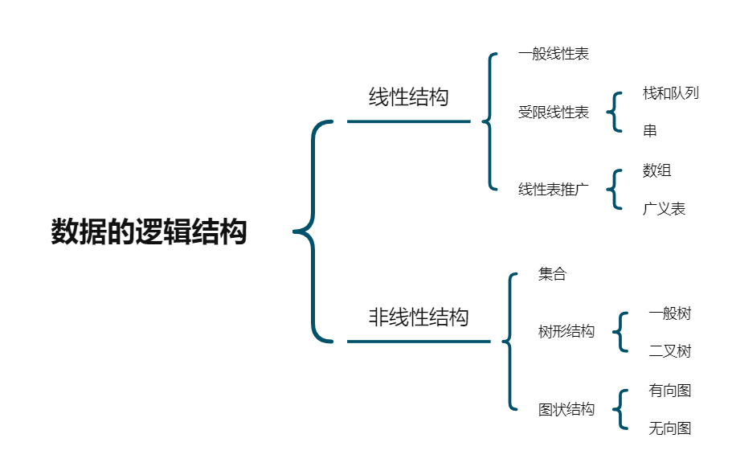
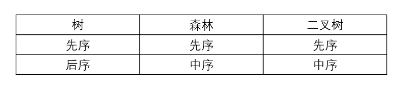
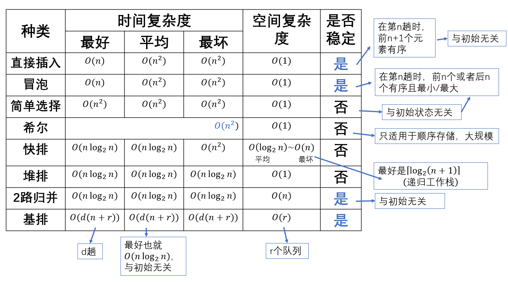

# 概述



存储结构

- 顺序存储
- 链式存储
- 索引存储
- 散列存储

<!-- more -->

1. 以下属于逻辑结构的是(`C`)
    A、顺序表  B、哈希表  C、有序表 D、单链表

        有序表是关键字有序的线性表，只描述逻辑

2. 以下与数据存储结构无关的术语是(`D`)
    A、循环队列 B、链表 C、哈希表 D、栈

        循环队列是顺序表表示的队列，而栈是抽象数据结构

在存储数据时，应该存储 1. 各个数据元素的值 2. 数据元素的关系

链式存储设计中，不同结点的存储空间可以不连续，但结点内的存储单元地址必须连续

## 推导时间复杂度

``` C++
int i = 1;
while(i <= n) {
    i = i*2;
}
```

找到正比的循环变量代入条件求解

设次数为$t$，则 $2^t \leq n  $  --->  $t \leq log_2{n}$

``` C++
int y=5;
while((y+1)*(y+1) < n) {
    y = y + 1;
}
```
`y+1`的次数与$T(n)$成正比
设次数为$t$,则 $t = y - 5$
$(y+5+1)(t+5+1) < n$
$t < \sqrt{n-6}$
所以$T(n) = O(\sqrt{n})$

2. 递归程序

$T(n) = 1 + T(n-1) = 1 + 1 + T(n-2) = ...... = n -1 + T(1)$
所以$T(n) = O(n)$

# 树和二叉树

## 树的性质

- $结点数 = 结点度数 + 1$
- $度为 m 的树，第 i 层，至多m^{i-1}个结点$
- $高度为h的m叉树至多有\frac{m^h-1}{m-1}个结点$  ===> $1+2+3+4+5...$
- $具有n个结点的m叉树最小高度为\lceil\log_m{(n(m-1)+1)}\rceil$  ===> $ n\leq \frac{m^h-1}{m-1} $  ===> $h\geq\log_m{(n(m-1)+1)}$

## 二叉树的性质

- $叶子结点数等于度为2的结点数加1,即n_0 = n_2 + 1$
- $第k层至多2^{k-1}个结点$
- $高度为h，至多2^h-1个结点$
- $结点i所在的层次为\lfloor\log_2i\rfloor+1$
- $具有n个结点的完全二叉树高度为\lceil\log_2{(n+1)}\rceil或者是\lfloor\log_2n\rfloor+1$

$对于满m叉树，双亲结点为i号，则孩子结点第一个编号为j = (i-1)*m+2$

在二叉树中有2个结点，m和n，则使用(`C`)可以找到m到n的路径
A、先序   B、中序   C、后序   D、层次

线索二叉树是一种物理结构  ===> 加上了线索的链表结构
二叉树是逻辑结构

二叉树线索化后，仍不能有效求解的问题是(`D`)
A、先序线索二叉树中求先序后继
B、中序线索二叉树中求中序后继
C、中序线索二叉树中求中序前继
D、后续线索二叉树中求后序后继

$对于n个不同元素进栈,出栈序列个数为\frac{1}{n+1}C_{2n}^{n}$

$在m叉树的情况下，结点i的第一个子女编号为j = (i-1)*m+1$
$在m叉树的情况下，结点i的双亲的编号是\lfloor(i-2)/m\rfloor+1$

二叉树遍历的对应关系


# 图

## 有向图与无向图

$有向图： n个顶点，n(n-1)/2条边$
$无向图： n个顶点，n(n-1)条有向边$

## 邻接矩阵

- 对称且唯一
- 空间复杂度$O(n^2)$
- 对无向图而言：$第i行非零个数为第i个顶点的度$
- 对有向图而言：$第i行为出度的个数，第j列为入度的个数$

## 邻接表

- 存储空间
    1. 无向图：$O(|v|+2|e|)$
    2. 有向图：$O(|v|+|e|)$
- $顶点v在边表中出现次数为v的入度$
- $v的出度即为链表的长度$
- 不唯一

## 十字链表

- 对有向图而言

## 邻接多重表

- 对无向图而言

## BFS(层序)

- $队列$
- $空间复杂度O(|v|)$
- $时间复杂度：$
    1. $邻接矩阵:O(|v|^2)$
    2. $邻接表：O(|v|+|E|)$

## 应用

### 最小生成树

1. $Prim--O(|v|^2)$

    - 每次找两集合相连的边中的最小
    - 适合稠密图

2. $Kruskal--O(|E|\log|E|)$

    - 寻的边的权值是递增的
    - 适合边稀疏，顶点较多的图

### 最短路径

1. 单源最短路径：

    - $Dijkstra：与Prim类似$
    - $邻接矩阵O(|v|^2)$
    - 不允许负值

2. 每对顶点最短路径：

    - $Floyd算法---O(|v|^3)$
    - $每迭代一次，在从v_i到v_j的最短路径上就多考虑了一个顶点$
    - 允许负权值，但不允许负权值组成回路

### 拓扑排序

1. $每次选取入度为0的点$
2. $O(|V|+|E|)$
3. 邻接矩阵为三角阵，则存在拓扑排序，反之不成立

### 关键路径

AOE： 顶点表示事件，有向边表示活动

- 事件(点)最早发生时间：从前向后，最长
- 事件(点)最迟发生时间：从后向前，用最长减去最长
- 活动(边)最早开始时间：边前面的点的最早开始时间
- 活动(边)最迟开始时间：边后面的点的最迟时间与本身的权值之差

# 查找

## 顺序查找

1. 一般线性表
ASL<sub>成功</sub> $= \frac{1}{n}*\frac{(n+1)*n}{2} = \frac{n+1}{2}$
ASL<sub>不成功</sub> $=n*(n+1)*\frac{1}{n} = n+1$

2. 有序表
ASL<sub>成功</sub> $= \frac{n+1}{2}$
ASL<SUB>不成功</sub>$=\frac{1+2+3+...+n+n}{n+1}= \frac{n}{2}+\frac{n}{n+1}$

## 折半查找

1. ASL<sub>成功</sub>$=\frac{1}{n}*(1*1+2*2+...+h*2^{h-1})=\frac{n+1}{n}log_2{(n+1)}-1\approx log_2{(n+1)}-1$
2. 查找不成功的次数至多为：$\lceil log_2{(n+1)}\rceil = \lfloor log_2n +1 \rfloor$
    $失败结点个数*(所在层数-1)$
3. $时间复杂度: O(log_2n)$

## 分块查找

1. 块内无序，块间有序
2. 第一步：顺序查找或折半查找索引表
   第二步：块内顺序查找
3. $若查找表长为n，分b块，每块S个记录，若均采用顺序查找，ASL = L_1+L_2=\frac{b+1}{2}+\frac{S+1}{2}= \frac{S^2+2S+n}{2S}$
$若块的长度=(总长度)^\frac{1}{2},即S=\sqrt{n},则ASL=\sqrt{n}+1$
$若索引表为折半查找，ASL = \lceil log_2{(b+1)} \rceil+ \frac{S+1}{2}$

## B树和B+树

### $m阶B树$

1. $各个结点子树个数x:$
   $若为根，则2\leq x \leq m$
   $若为非叶结点：则\lceil \frac{m}{2} \rceil \leq x \leq m$

2. $各个结点关键字个数：$
   $若为根，则1\leq x \leq m-1$
   $若为非叶结点：则\lceil \frac{m}{2} \rceil -1 \leq x \leq m-1$

3. $m阶B树， n个关键字，结点个数为k，高度为h$
   $则  \lceil \frac{m}{2} \rceil ^ h -1 \leq k \leq \frac{m^h-1}{m-1}$
   $log_m{(n+1)} \leq h \leq log_{\lceil \frac{m}{2} \rceil}{( \frac{n+1}{2} )}+1 $
   $ (\lceil \frac{m}{2} \rceil -1 )(2^h-2) +1 \leq n \leq m^h-1$

### $B+树$

1. 非叶根结点(既不是叶结点也不是根结点)至少2棵子树，其他分支结点至少$\lceil \frac{m}{2} \rceil$个子树
2. 结点子树个数与关键字个数相等
3. $各个结点关键字个数x：$
   $若为根：1 \leq x \leq m$
   $若非根： \lceil \frac{m}{2} \rceil \leq x \leq m$
4. 分支结点的某关键字为其子树中最大关键字的副本

## 散列表

1. 冲突/碰撞不可避免
2. ASL<sub>成功</sub>看关键字个数和冲突次数
   ASL<sub>失败</sub>看表长

## 串

$'ababa' 求next[]$
$'a'  前缀：\emptyset 后缀：\emptyset \Longrightarrow \emptyset \bigcap \emptyset = \emptyset \Longrightarrow n = 0$
$'ab' 前缀：\{a\} 后缀：\{b\} \Longrightarrow \{a\} \bigcap \{b\} = \emptyset \Longrightarrow n = 0 $
$'aba' 前缀：\{a,ab\} 后缀：\{a,ba\}\Longrightarrow \{a,ab\} \bigcap \{a, ba\} = \{a\} \Longrightarrow n=1$
$'abab' 前缀：\{a,ab,aba\} \bigcap 后缀：\{b,ab,bab\} = \{ab\} \Longrightarrow n=2$
$'ababa' 前缀：\{a,ab,aba,abab\} \bigcap \{a,ba,aba,baba\} = \{a,aba\}\Longrightarrow n=3$

next数组有三种表示方法：

- $00123$
- $右移一位：(-1) 0012$
- $全部加一：01123$

# 排序



## 概念

1. 同一线性表使用不用的排序方法，结果可能不同
2. n个关键字基于比较的排序，两两比较次数至少为$\lceil log_2{(n!)} \rceil$

## 插入排序

基本有序，数据量不大

1. 直接插入排序： 适用于顺序或者链式存储(边比较边移动)
2. 折半插入排序： 先折半查找插入的位置，再移动，再插入，比较次数为$O(nlog_2n)$
3. 希尔排序：
    - $d_1 = \frac{n}{2} 并且 d_i=\lfloor  \frac{d_{i-1}}{2} \rfloor$
    - 各个组使用直接插入排序
    - 重复迭代，直到$d_t = 1$

## 交换排序

### 冒泡排序

- 每次最小的元素放第一个位置
- 从后往前两两比较，若为逆序则交换

过程产生的有序子序列一定是全局有序的，这点与插入排序不同

### 快速排序

快排需要掌握算法

``` C++
void QuickSort(ElemType A[], int low, int hight) {
    if(low < hight) {
        int pivotpos = Partition(A, low, hight);
        QuickSort(A, low, pivotpos - 1);
        QuickSort(A, pivotpos + 1, hight);
    }
}

int Partition(ElemType A[], int low, int hight) {
    ElemType pivot = A[low];
    while(low < hight) {
        while(low < hight && A[hight] >= pivot) 
            --hight;
        
        A[low] = A[hight];

        while(low < hight && A[low] <= pivot>)
            ++low;

        A[hight] = A[low];
    }
    A[low] = pivot;
    return low;
}

```

## 选择排序

从前往后，每个元素与后面所有元素比较

### 简单选择

$移动次数： \leq 3(n-1) $
$比较次数： \frac{n(n-1)}{2}$

### 堆排序

1. $构建时：对结点 \lfloor \frac{n}{2} \rfloor 一直到根的子树进行筛选$
2. 排序：
    - 输出堆顶，删除根节点
    - 堆底送入根节点
    - 自上而下调整，重复排序的第一步
3. 插入： 
    - 结点插入到堆底
    - 自下而上调整

## 归并与基排

1. 归并排序
$对于N个元素，进行K路归并排序，趟数为m，则 K^m = N,所以m=\lceil log_k{N} \rceil$

2. 基数排序
- 最高位优先
- 最低位优先(推荐)

## 外部排序

1. $外部排序的总时间 = 内部排序时间 + 外存信息读写时间 + 内部归并时间$
$t_{es} = rt_{IS} + dt_{I/O}+S(n-1)t_{mg}$ 
$其中，r是初始归并段个数，d是外存访问次数，t_{I/O}是外存读写时间，S是归并趟数，(n-1)是记录数，t_{mg}是取关键字最小记录时间$

2. 在做m路平衡归并时，为实现输入/内部归并/输出的并行处理，要**2m**个输入缓冲区和**2**个输出缓冲区

3. $若一个2000记录文件，一个磁盘块250个记录，8个磁盘块，2路归并$
$则，2000/250 =8，即每趟8次读+8次写$
$归并段个数为8 ===> 内部排序 ===> 8+8次读写$
$S=\lceil log_m{r} = log_28 = 3 \rceil$
$所以读写次数为： 3(8+8) +8 + 8 = 64$
$所以,t_{es} = 8t_{Is}+64t_{I/O} + 3*2000t_{mg}$

4. 多路平衡归并与败者树

- $S趟归并共需比较次数：$
  $S(n-1)(m-1) = \lfloor log_mr \rfloor (n-1)(m-1)= \frac{\lfloor log_2r \rfloor (n-1)(m-1)}{\lfloor log2m \rfloor}$
- 败者树：为了选出最小的元素
  A、 大的为失败者，小的为胜利者
  B、 非叶节点记录败者(较大的)
      比较时却比胜者(较小的)
- 置换-选择排序
  1. 生成初始归并段
  2. 长度不一时，使用哈夫曼树
  工作区选择最小的元素就是使用败者树的

- 最佳归并树(采用哈夫曼树的思想)
  记录数少的归并段先归并，总的I/O次数为2*(WPL)

$判断虚段数目x$
$n_0个归并段，m路归并$
$若(n_0-1)\%(m-1)=u \neq 0$
$则需要x=m-u-1个虚段$

