# 计算机概述

- 吞吐量：系统在单位时间内处理请求的数量
主要取决于主存的存取周期
- CPU时钟周期(节拍脉冲，T周期)：最小时间单位
每个动作至少一个时钟周期
- 主频：CPU时钟频率，时钟周期的倒数
- CPI：执行一条指令所需要的时钟周期数
- CPU执行时间，运行一个程序所花费的时间
$ CP执行时间 = \frac{CPU时钟周期数}{主频} = \frac{指令条数*CPI}{主频}$
- MIPS：每秒执行多少百万条指令
$MIPS = \frac{指令条数}{执行时间*10^6}=\frac{主频}{CPI}$
$指令周期=\frac{1}{MIPS}$
- 程序员可见的寄存器：
    - 状态寄存器
    - 通用寄存器
- 程序员不可见(透明)的寄存器：
    - IR
    - MAR
    - MDR

<!-- more -->

# 数据的表示与运算

## BCD码：
- 8421码： 1010 ~ 1111 六个无效码，区间位于此的要+6修正
- 余3码： 在8421码的基础上加上(0011)2
- 2421码

## ASCII码：

数字0 ~ 9 ===> 48 ~ 57
共7位

## 大端存储

高位字节向低位字节顺序存放，符合人类思维

## 码距

各位异或之后结果为1的个数

## 奇偶检验码

码距为2

## 海明校验码

$海明不等式：2^r \geq n+r+1(其中n为信息位，r为冗余信息位)$
$纠错理论： L-1 = D+C且D \geq C(其中L为码距，D为检错的位数，C为纠错位数)$

## 循环冗余码(CRC)

此处的知识点与计算机网络一样

## 定点小数

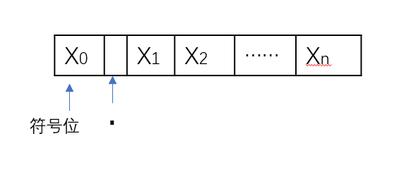

$01…1 ===> 最大正数： 1-2^{-n}$
$11…1 ===> 最大负数： -(1-2^{-n})$

## 定点整数

最大正数：$2^n-1$
最小负数：$-(2^n-1)$

## 原码

小数：

$$ [x]_{原码}=\left\{
\begin{array}{rcl}
x       &      & {0 \leq  x < 1}\\
1-x = 1+|x|     &      & {-1 < x \leq 0}\\
\end{array} \right. $$

对于负小数:
$x=-0.x_1x_2...x_n$
$[x]_{原码} = 1.x_1x_2...x_n$

对n+1字长：
$-(1-2^{-n}) \leq x \leq 1-2^{-n}  原点对称$
真值0有$+0$和$-0$两种表示

## 补码

小数：
$$ [x]_{补码}=\left\{
\begin{array}{rcl}
x       &      & {0 \leq  x < 1}\\
2+x=2-|x|     &      & {-1 \leq x < 0}\\
\end{array} \right. $$

整数：
$$ [x]_{补码}=\left\{
\begin{array}{rcl}
0,x       &      & {0 \leq  x < 2^n}\\
2^{n+1}+x=2^{n+1}-|x|     &      & {-2^n \leq x \leq 0}\\
\end{array} \right. $$

对小数而言：多了一个-1 ===> 1.0000
整数:比原码多了一个$-2^n$

## 反码

小数：
$$ [x]_{反码}=\left\{
\begin{array}{rcl}
x(正数不变)      &      & {0 \leq  x < 1}\\
(2-2^{-n})+x     &      & {-1 < x \leq 0}\\
\end{array} \right. $$

范围：$-(1-2^{-n}) \leq x \leq 1-2^{-n}$
原点对称 ===> 真值0的反码不唯一
- 0.000...
- 1.111...

## 移码

$[x]_{移码} = 2^n +x(字长为n+1)$

$x_1 = +10101~~~x_2=-10101(字长为8)$
$[x1]_{移码} = 2^7+10101 = 1,0010101$
$[x2]_{移码} = 2^7+(-10101) = 0,1101011$

特点：
1. 零的表示唯一
2. 与补码相差一个符号位
    $[x]_{补码} = [x]_{移码}的符号位取反$
3. 全0表示最小值：$-2^n$
全1表示最大值：$2^n-1$
4. 保持数据原有的大小顺序

## 数值表示之间的关系

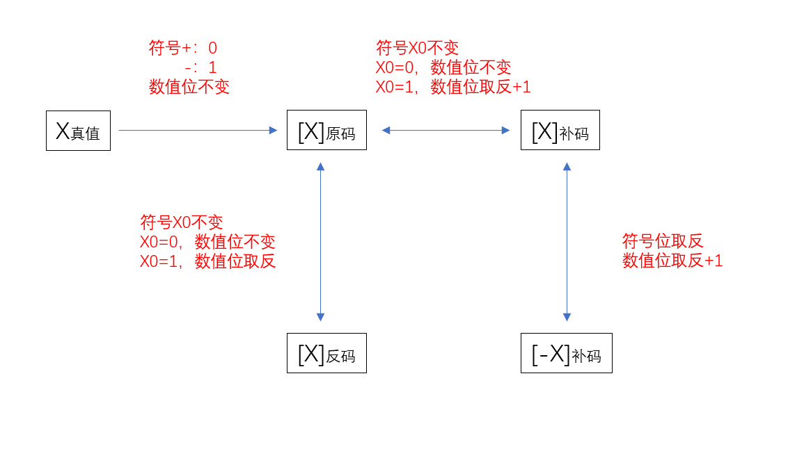

当$x$为正数时：
$x = [x]_{原码} = [x]_{反码} = [x]_{补码}$

## 定点数的移位运算

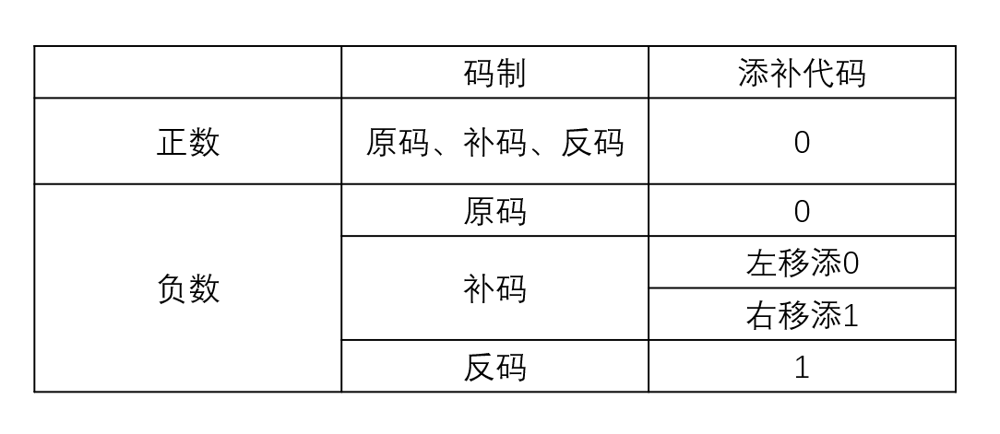

逻辑移位不管左移还是右移，都添加0

## 符号拓展

1. 原有形式的符号位移到新形式的符号位上
2. $$ 负数\left\{
\begin{array}{rcl}
原码：补0      &      & {}\\
补码：整数补1，小数补0     &      & {例如：-1101 ==> 0011 ==> 1[111]_{补1}0011}\\
反码：补1
\end{array} \right. $$

## 溢出判断

1. 符号位
    - 参加操作的两个数，符号相同，结果又与原操作数符号不同，则溢出
2. 双符号位
    - 01 正溢出
    - 10 负溢出
3. 一位符号位与数据位的进出
    - $V = C_s \bigoplus C_1 ~~~~ 若v=0 ~~无溢出(相同)， 若v=1 ~~则溢出(相异)$

## 各个码制之间关系的实例

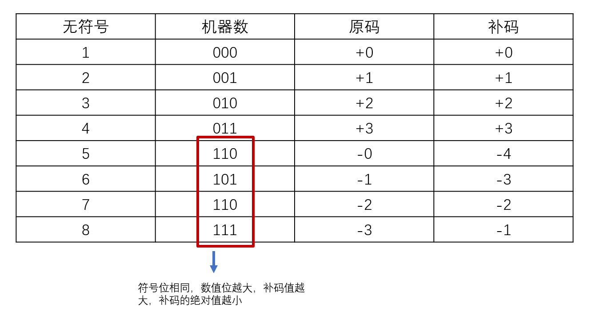

## 规格化浮点数

左规：可能多次
右规：只用一次

1. 原码规格化：
$ \frac{1}{2} \leq M \leq (1-2^{-n}) $
$-(1-2^n) \leq M \leq -\frac{1}{2}$

2. 补码规格化：
$\frac{1}{2} \leq M \leq (1-2^{-n})$
$-1 \leq M \leq -(\frac{1}{2} +2^{-n})   ===> -(0.100...1) ===> \frac{1}{2} + ... +\frac{1}{2^n}$

## 不同基数之间的特点

1. 基数为2：
    - 原码：尾数最高为1
    - 补码：尾数最高位与尾数符号位相反

2. 基数为4：
    - 原码：最高2位不全0

3. 基数为8：
    - 原码：最高3位不全0
    - 补码：负 -> 前三位不全1

## IEEE 754
单精度float  ===> 32位

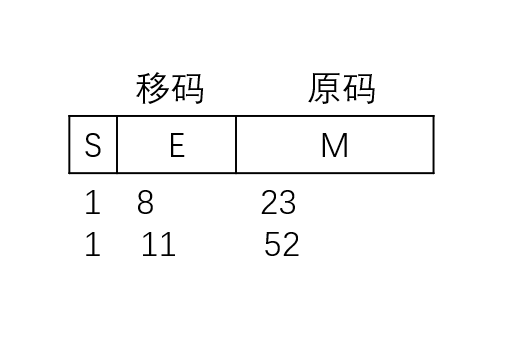

$(-1)^s*1.M*2^{E-127} ~~~~E\in[1, 254]$

规定：
- $E = 0且M=0，真值0$
- $E = 0且M\not=0,非规格化，真值=(-1)^s*0.M*2^{-126}$
- $1 \leq E \leq 254~~~ 真值=(-1)^s*1.M*2^{E-127}$
- $E = 255且M \not=0时，真值为‘NAN’ $
- $E=255且M=0，表示正无穷或负无穷(看符号位)$

| 格式  | 最小值 | 最大值 |
| :----:| :----: | :----: |
| 单精度 | $E=1，M=0,1.0*2^{1-127}=2^{-126}$ | $E=254,M=1.11...,1.111...*2^{254-127}=2^{127}(2-2^{-23})$ |
| 双精度 | $E=1,M=0,1.0*2^{1-1023}=2^{-1022}$ | $E=2046,2^{1023}*(2-2^{52})$ |

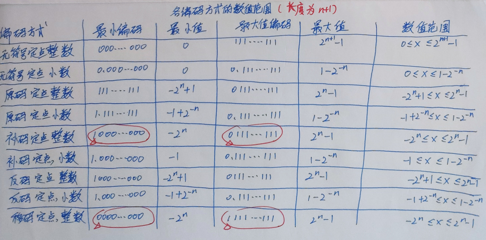

# 存储系统
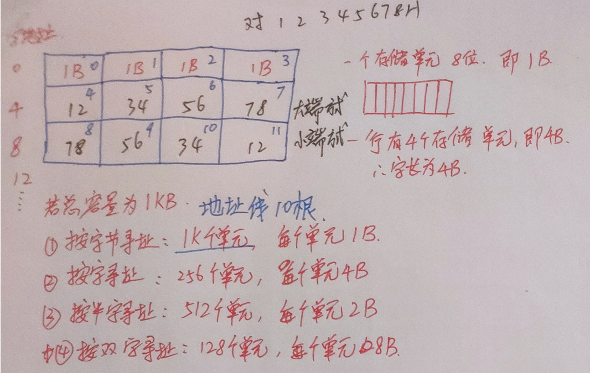

## SRAM

静态随机存储器
双稳态触发器(六管Mos)、非破坏性读出、易失性、集成度低

## DRAM(动态)
电容、一次刷新一行存储单元
- 集中刷新，有访存“死区”
- 分散刷新
- 异步刷新

DRAM采用地址复用技术(以及ROM)
SRAM不采用

## ROM(密度高、非易失性)

- MROM: 写入后无法修改
- PROM：可编程
- EPROM：可擦除可编程
- 闪速存储器
- 固态硬盘(SSD)

## 字位拓展
注意$\overline{CS}$为低电平有效

## 地址分配与片选
1. 线选法
n条线 ---> n个选片信号
电路简单、地址空间不连续

2. 译码片选法(使用译码器)
n条线 ---> $2^n$个选片信号
电路复杂，地址空间连续，可加逻辑设计

## 双端口RAM

可行：
- 两个端口不同时对同地址存取
- 两个端口同时对同地址读

不可行：
- 同时对同地址写
- 同时对同地址，一个读，一个写

## 多模块

- 单体多字，一次取多字
- 多体并行
    - 高位交叉(体号+体内地址)
    连续取$n$个字：$T_总 = n*T_单$
    - 低位交叉(体内地址+体号)
    连续取$n$个字：$T_总=T_单+(n-1)\tau(\tau为启动下一个存储器时间，即总线传送周期)$
    $当字长为W时：带宽= \frac{nW}{T+(n-1)\tau}$

## Cache和主存的映射

### 直接映射：主存数据块放Cache中唯一位置

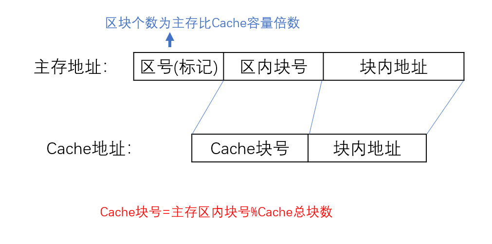

地址变换：主存地址 ===> Cache中的地址
1.  取主存块号  ===> 找到Cache块号
2. 比较Cache块号中的区号(标记)与主存的区号(标记)是否一致
3. 若是，则主存的区块号+块内地址 = 访问Cache的地址

### 全相联映像：主存数据块随意放在Cache中

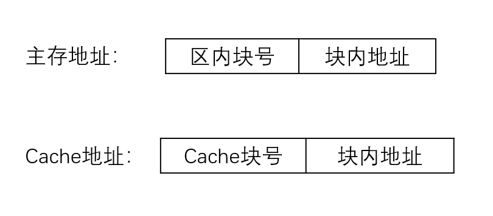

地址变换：
1. 取主存块号  ---> 与标识Cache(标识Cache可能是一个存放一张表的Cache)全表比较
2. 若找到，则取出Cache块号
3. Cache块号 + 块内地址 = 访问Cache的地址 

### 组相联映像:只能放特定组，组内可以随意放

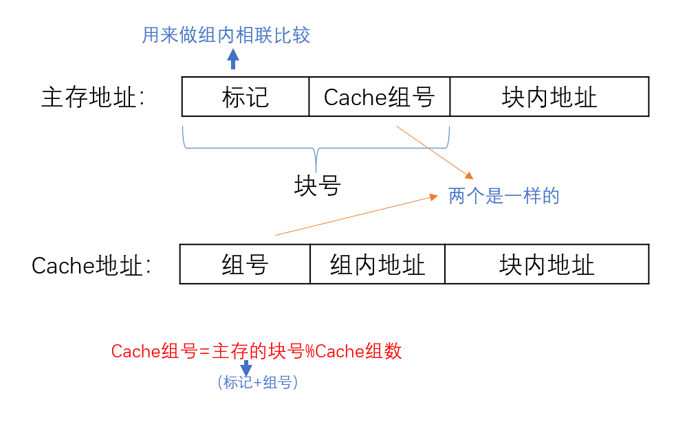

地址变换机构：
1. 取出主存地址的块号，取余，得到Cache的**组号**
2. 通过组号在标识Cache中找到对应的组
3. 一般一个组有好几块，用主存的标记与该组中的每一块作比较，看是否命中
4. 若命中，则取出标识Cache中的**组内块号**
5. Cache地址 = 组号 + 组内地址 + 块内地址

### Cache写策略：

- Cache命中
    - 全写法：数据同时写入Cache和主存
    - 写回法：先只修改Cache内容，换出时才写回主存

- 不命中
    - 写分配法：加载主存的块到Cache中
    - 非写分配法：只写入主存，不进行调块

写分配法  ===> 写回法
非写分配法 ===> 全写法

# 指令系统

## 概述

- $访存次数 = 取指令一次+取操作数n次+回存一次$
- $设地址长度为n，上层留出m种状态，下层可多拓展m*2^n种状态$

## 地址格式
- 零地址
- 一地址
    - $OP(A_1)~~-->~~A_1(三次访存)$
    - $(隐含)~~(ACC)OP(A_1)~~-->~~ACC(两次访存，结果放寄存器中)$
- 二地址
    - $(A_1)OP(A_2)~~-->~~A_1(四次访存)$
- 三地址
    - $(A_1)OP(A_2)~~-->A_3(四次访存，取址一次，取操作数两次，回存一次)$
- 四地址：
    - $(A_1)OP(A_2)~~-->~~A_3~~~~~A_4为下一条指令执行地址(四次访存)$

## 寻址方式：EA表示操作数的有效地址

1. 隐含寻址(0次访存)：另一个操作数隐含在了$ACC$中
    - $(ACC)OP(A_1)~~-->~~ACC$

2. 立即(数)寻址(0次访存)：地址字段直接就是操作数本身

3. 直接寻址(一次访存)：地址$A$就是$EA$
    - 地址位数为$k$,寻址范围为$2^k$

4. 间接寻址(两次访存)：$EA=(A)$
    - 字长为$m$,寻址范围$2^m$

5. 寄存器寻址(0次访存)：
    - 直接寻址的主存换成了寄存器

6. 寄存器间接寻址(一次访存)：
    - 间接寻址的第一步是找到寄存器

7. 相对寻址(一次访存)：
    - PC的内容加上指令格式中的形式地址A而形成操作数的有效地址
    - $EA = (PC) + A$
    - $A$的位数决定了操作数的寻址范围
        - 便于程序浮动
        - 转移指令
    
8. 基址寻址(一次访存)：
    - $EA = (BR)+A$
    - 面向操作系统，基址寄存器内容不变，形式地址可变(作偏移)
        - 扩大寻址范围
        - 有利于多道程序设计
        - 可编制浮动程序

9. 变址寻址(一次访存):
    - $EA=(IX)+A$
    - 寄存器位数/字长$m$,寻址范围$2^m$
    - 面向用户，变址寄存器内容可由用户改变，形式地址$A$不变
    - 扩大了寻址范围
    - 适合编制循环变量(数组)

## 混合的寻址方式

1. 先变址后间址：$EA=(A+(IX))$
2. 先间址后变址：$EA=(A)+(IX)$
3. 变址基址一起: $EA=A+(BR)+(IX)$

## 复杂指令集(CISC)和精简指令集(RISC)

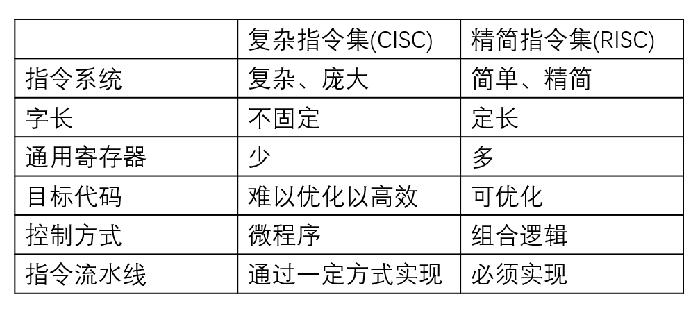

# 中央处理器

## 运算器
- 算术逻辑单元(ALU)
- 暂存寄存器
- 累加寄存器(ACC)
- 通用寄存器组
- 程序状态字寄存器(PSW)
- 移位器
- 计数器(CT)

## 控制器
- 程序计数器(PC)
- 指令寄存器(IR)
- 指令译码器(ID)
- 存储器地址寄存器(MAR)
- 存储器数据寄存器(MDR)
- 时序系统
- 微操作信号发生器
- 中断控制逻辑

指令部件包括：PC、IR、ID

## 寄存器
用户可见：
- PC
- PSW
- ACC
- R0/R1/R2/R3

用户不可见：
- MAR
- MDR
- IR

## CPU

- ALU
- 寄存器
- 中断系统
- 时序控制(CU)

## 指令周期

完成一条指令：
- 取址周期：取址、分析
- 执行周期：执行指令

$时钟周期 < 机器周期 < 指令周期$
一般一个阶段对应一个机器周期
一个机器周期存在若干个时钟周期

指令译码是对指令的操作码字段进行译码的

## 指令周期的数据流

### 取址周期：
1. PC ==> MAR ==> 地址总线 ==> 主存
2. CU发出控制信号 ==> 控制总线 ==> 主存
3. 主存 ==> 数据总线 ==> MDR ==> IR
4. CU发出读命令 ==> PC+1

### 间址周期
1. Ad(IR) ==> MAR ==> 地址总线 ==> 主存
2. CU发出读命令 ==> 控制总线 ==> 主存
3. 主存 ==> 数据总线 ==> MDR

### 执行周期
不定

### 中断周期
1. CU控制SP-1，SP ==> MAR ==> 地址总线 ==> 主存
2. CU发出写命令 ==> 控制总线 ==> 主存
3. PC ==> MDR ==> 数据总线 ==> 主存(断点存入主存)
4. CU(中断服务程序入口地址) ==> PC

## 指令执行流程
固定的前三步：
- (PC) ==> MAR, READ
- (PC)+1 ==> PC
- (M ==> MDR) ==>IR 

## 微指令
- 一条机器指令就是一个微程序
- 一个微程序包含若干个微指令
- 一条微指令包含若干微操作
- 一个微操作 = 一个微命令

指令系统中具有$n$种机器指令，则微程序数至少为$n+1$个
其中的$1$为公共的取址微程序，若带中断，再$+1$

## 微指令编码方式
1. 直接编码方式：(又快又长)
字段种的每一位都代表一个命令
2. 字段直接编址方式(慢)
需要译码电路译码
    - 互斥性微命令放同一段，相容性微命令放不同段(同时执行)
    - 留一个状态位，即 ==> 若有三位，则只能表示7个互斥微命令
3. 字段间接编码

## 微指令格式

1. 水平型微指令：
定义并执行几种并行的基本操作
    - 微程序短
    - 执行速度快
    - 微指令长

2. 垂直型微指令
定义并执行一种基本操作
    - 微程序长
    - 执行速度慢
    - 微指令短

3. 混合型微指令
垂直 + 简单并行

## 微程序控制单元
因为微指令的地址均由上一条微指令的下地址字段直接给出
所以每一条微指令都要加一个将微指令下地址字段送到CMAR的微操作

$取址：$
$T_0:PC \rightarrow MAR, 1 \rightarrow R$
$T_1:Ad(CMDR) \rightarrow CMAR$
$T_2:M(MAR) \rightarrow MDR,(PC) + 1 \rightarrow PC$
$T_3:Ad(CMDR) \rightarrow CMAR$
$T_4:MDR \rightarrow IR$
$T_5:PC(IR) \rightarrow 微地址形成部件 \rightarrow CMAR$

## 指令流水线：
$取址 \rightarrow 分析 \rightarrow执行$

1. 顺序执行：$T=3nT$ 
2. 一次叠加执行:$T=3t+(n-1)2t=(1+2n)t$
3. 二次叠加执行：$T=3T+(n-1)T=(2+n)t$

## 影响因素
1. 结构相关(资源冲突)
多条指令同一时刻争用同一资源  ===>  资源重复配置
2. 数据相关(数据冲突)
存在先后顺序，前一个完成才能执行后一个 ===> 数据旁路技术
    - 读后写(WAR)：乱序发射
    - 写后读(RAW)：后续指令用到相关数据
    - 写后写(WAW，写的是两个不同指令)：各个功能部件
3. 控制相关
转移指令，其他改变PC值的指令

## 性能指标
1. 吞吐率
$TP = \frac{n}{T_k}(n个任务，T_k为完成总时间)$
$TP = \frac{n}{(k+n-1)\Delta t}(k为流水线段数，\Delta t是时钟周期)$
$当n \rightarrow \infty 时,TP=\frac{1}{\Delta t}$

2. 加速比
$S= \frac{T_0}{T_k}(T_0为不使用流水线时间，T_k为使用流水线时间)$
$S= \frac{kn \Delta t}{(k+n-1) \Delta t} = \frac{kn}{k+n-1}$
$当n \rightarrow \infty 时,S_{max} = k$

3. 效率
$E = \frac{n个任务有效面积}{时空总面积} = \frac{T_0}{kT_k}$
$当n \rightarrow \infty 时,E_{max} = 1$

# 总线

## 系统总线
1. 数据总线(双向)
2. 地址总线(单向)
3. 控制总线

## 工作频率：一秒内传递几次数据
$若总线周期 = N个时钟周期$
$则总线工作频率=\frac{时钟频率}{N}$
$总线带宽 = 总线工作频率*\frac{总线宽度}{8}$

## 集中仲裁方式

1. 链式查询方式(3条线，请求线1，总线忙1，总线允许1)
顺序查询每一个设备，离总线控制器越近，优先级越高
    - 简单，易拓展，优先级固定
    - 电路敏感
    - 优先级不灵活
2. 定时器定时查询方式($\lceil log_2n \rceil +2 $条线，请求1，总线忙1，总线允许$\lceil log_2n \rceil $)
有请求  ==> 计数器计数 ==> 值与请求设备一致
    - 优先级灵活
    - 线多复杂

3. 独立请求方式(2n+1条线，请求n，允许n，忙1)
每一个设备都有一个请求线$BR_i$和总线允许线$BG_i$
    - 响应快，优先级灵活
    - 线多复杂

## 总线异步定时方式(按需分配时间)

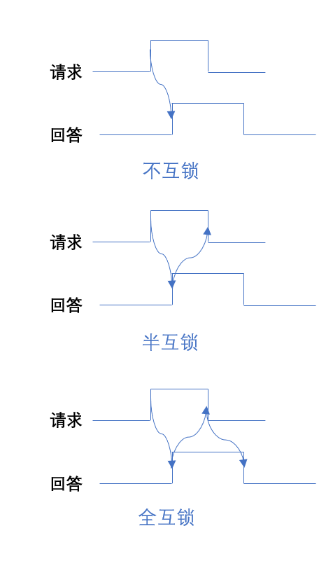

## 总线标准
- ISA: 最早微机系统总线
- EISA: 扩展ISA(32位)
- VESA: 局部总线，活动图像，多媒体
- PCI: 局部总线，外围部件，显卡，声卡，网卡
- PCI-Express: 取代PCI、AGP
- AGP: 局部总线，视频接口
- RS-232C: 串行二进制，数据终端与通信
- USB: 设备总线，串行
- PCMCIA: 笔记本电脑
- IDE: 磁盘驱动器
- SCSI: 智能设备(硬盘、软盘、光驱、打印)
- SATA: 硬盘接口，行业标准

# 输入/输出系统

## 显式存储器

$VRAM容器 = 分辨率 * 灰度级位数$
$VRAM带宽 = 分辨率 * 灰度级位数 * 帧频$

## 磁盘

$存取时间 = 寻道时间 + 旋转延迟时间 + 传输时间$
$数据传输率D_r = rN(r为转速，r转/秒，N为每个磁道N个字节)$

地址格式：
|  驱动器号(磁盘)   | 柱面(磁道)号  |  盘面号   | 扇区号  |
|  ----  | ----  |  ----  | ----  |

## 冗余阵列

RAID0 无容错能力

## I/O接口的基本结构

- 内部接口：与内存，CPU相连(并行)
- 外部接口：外设相连(串行)

## I/O端口编址

1. 统一编址：存储器映射
    - 优点：不需要专门的I/O指令，灵活、方便、编址空间大
    - 缺点：内存容量变小，执行速度慢

2. 独立编址：I/O映射方式
    - 优点：程序编制清晰，易理解
    - 缺点：要专门的I/O指令，控制更复杂

## I/O方式

与操作系统中一致

## 中断处理过程

1. 关中断
2. 保存断点
3. 识别中断源
4. 保存现场
5. 中断事件处理
6. 恢复现场
7. 开中断
8. 中断返回

其中，前三步由硬件完成，又称中断隐指令，后四步又软件(操作系统完成)，又称为中断服务程序

